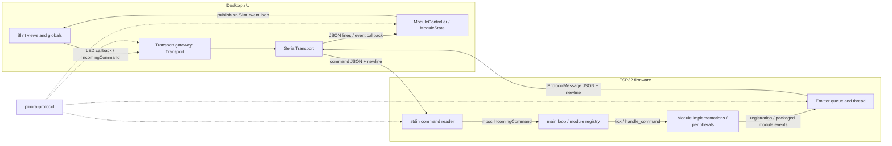
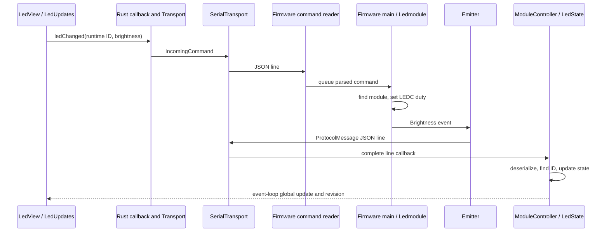

# Pinora

Pinora is a modular Rust system that connects a native Slint desktop client to ESP32 hardware through a shared JSON protocol. The current firmware registers three PWM LEDs; the desktop discovers them, sends brightness commands, and receives brightness events.

**Pre-alpha:** the serial LED control path is implemented across all three crates, but the broader module system is incomplete. Compilation and source tracing do not establish hardware reliability. This README distinguishes active configuration, compiled implementations, dormant source, and UI placeholders.

## What is Pinora?

Pinora separates hardware behavior, wire messages, and desktop presentation:

- **`Firmware_Templates/`** owns ESP-IDF initialization, peripherals, module instances, command dispatch, and event emission.
- **`protocol/`** provides the `pinora-protocol` crate: shared Serde types for registrations, commands, events, and system information.
- **`UI/`** owns the native desktop application, serial transport, module state, Slint views, and control callbacks.

The intended workflow is to configure and flash a firmware template, connect the desktop to its serial port, discover modules from their registrations, then inspect or control the modules with implemented views. Adding a module requires integration across these layers; adding a protocol enum variant alone does not produce a working hardware module or UI.

## Current status

| Area | Verified repository state |
|---|---|
| Project metadata | `pinora.toml`: project `Pinora_Template`, version `0.1.0`, metadata schema version `1` |
| Package versions | `pinora-ui` and `pinora-protocol`: `0.1.0`; `Firmware_Templates`: `0.5.0` |
| Maturity | Pre-alpha prototype; transport and module coverage remain partial |
| Cargo organization | Three independent crates with local path dependencies; no root `Cargo.toml` or Cargo workspace |
| Rust editions/toolchains | UI and protocol: edition 2024; firmware: edition 2021, toolchain `esp-1.93` |
| Rust version declaration | Firmware declares `rust-version = "1.82"`; this is not an overall minimum for its edition-2024 protocol dependency or desktop dependencies |
| Desktop framework | `slint` and `slint-build` from Git branch `pre-release/1.18`, not the old `1.16.1` release |
| Desktop serial dependency | `serialport = "4.10"` |
| ESP-IDF | Configuration requests `v5.5.3`; `esp-idf-svc = "0.52.1"`, with Git patches for `esp-idf-sys`, `esp-idf-hal`, and `esp-idf-svc` |
| Firmware target | `xtensa-esp32-espidf`, `MCU = "esp32"` |
| Wire format | Serde JSON, one newline-terminated message per frame |
| Implemented transport | Serial, in both directions; Wi-Fi and Bluetooth are stubs |
| Startup modules | `led1`, `led2`, `led3` on GPIO 12, 14, 27 |
| Live module views | LED controls and remote-receiver display; the remote receiver is not instantiated by current firmware |

Versions and build settings come from [project metadata](pinora.toml), the [UI manifest](UI/Cargo.toml), [protocol manifest](protocol/Cargo.toml), [firmware manifest](Firmware_Templates/Cargo.toml), and [firmware Cargo configuration](Firmware_Templates/.cargo/config.toml). The Slint branch and ESP Git patches can move. The local UI lockfile used for this review resolved Slint and slint-build to `1.18.0` at `2bb5a20694e75d2e8d50cbea91595f8ebff0d9a2`; that is a local resolution, not a revision pinned in the manifest.

## High-level architecture



Both application manifests depend on `pinora-protocol = { path = "../protocol" }`. The protocol crate has no Slint or ESP-IDF dependency. It defines the wire contract, while each application owns framing and transport behavior.

## Repository structure

```text
.
├── pinora.toml                         # Project name/version and directory metadata
├── justfile                            # Per-crate build/check/run/flash recipes
├── .gitignore                          # Build output, generated config, and lockfile exclusions
├── .espConfig/esp_config.json           # Legacy machine-specific project configuration
├── protocol/
│   ├── Cargo.toml
│   └── src/
│       ├── lib.rs                      # Public module declarations and re-exports
│       ├── command.rs                  # IncomingCommand and ModuleCommand
│       ├── registration.rs             # ProtocolMessage, Registration, SystemInfo
│       ├── module_event.rs             # ModuleEvent, EventPackage, and structured logs
│       ├── global_definitions.rs       # ModuleType
│       └── module/                     # Shared module payloads and supporting types
├── Firmware_Templates/
│   ├── .cargo/config.toml              # Target, linker, runner, IDF environment
│   ├── Cargo.toml
│   ├── rust-toolchain.toml
│   ├── sdkconfig.defaults              # ESP-IDF task stack defaults
│   ├── build.rs                        # embuild ESP-IDF build environment output
│   ├── pre-script.rhai                 # Template-generation MCU/IDF variable setup
│   └── src/
│       ├── main.rs                     # Active wiring, registry, runtime, command reader
│       ├── core/                       # ModuleCore/Module, HardwareContext, Emitter
│       ├── module/                     # Active-tree and disabled module implementations
│       └── utilities/                  # Numeric range and pulse conversion helpers
├── UI/
│   ├── .cargo/config.toml              # Windows MSVC linker stack size
│   ├── Cargo.toml
│   ├── build.rs                        # Compile ui/app-window.slint
│   ├── src/
│   │   ├── main.rs                     # Window, controller, transport, callback wiring
│   │   ├── type_box.rs                 # Shared incoming/outgoing callback aliases
│   │   ├── transport/                  # Gateway, serial, stubs, connection/error types
│   │   ├── module_controller/
│   │   │   ├── mod.rs                  # Registration and event routing
│   │   │   ├── module_definition.rs    # ModuleState and Rust-owned LidarState
│   │   │   └── module_methods/         # State updates, conversions, LED callback binding
│   │   └── ui_bridge/                  # Connection bindings and UI publication helpers
│   ├── ui/
│   │   ├── app-window.slint            # Root properties, exports, tabs, callbacks
│   │   ├── pages/                      # Dashboard, Modules, Playground
│   │   ├── components/                 # Cards, forms, slider, dynamic module display
│   │   ├── module_definitions/         # Slint state types, update globals, LED view
│   │   └── shared/                     # UI enums, ModuleView, theme
│   ├── tests/modules_layout.rs         # Software-rendered module layout regression test
│   ├── README.md                       # Existing short desktop notes
│   └── LICENSE                         # MIT text with placeholder copyright fields
└── README.md                           # Repository-wide architecture and workflow
```

There is no root Cargo command that builds a workspace. `just` orchestrates commands in each crate directory. `.gitignore` still contains workspace-oriented comments, but actually ignores all three crate lockfiles; there is no tracked root lockfile. Local lockfiles may exist, so a successful local `--locked` check is not a reproducible fresh-clone guarantee.

`pinora.toml` is project metadata, not a runtime hardware configuration loader: no authored application/build code reads it. Its commented `[device]` example does not select the firmware target. `.espConfig/esp_config.json` contains old absolute paths, including `UI_Templates`, and old build/flash commands; the current applications and justfile do not consume it. Use the manifests, Cargo configuration, and current entry points for build and hardware behavior.

## Desktop architecture

### Slint and Rust responsibilities

[UI/build.rs](UI/build.rs) compiles `ui/app-window.slint`; `slint::include_modules!()` exposes its generated Rust interface in [main.rs](UI/src/main.rs). The root Slint file deliberately re-exports module state types and globals for Rust to use.

The root window has three tabs:

- **Dashboard:** transport forms, connection state, ESP-IDF/heap/flash information, accepted registration count, and structured high/critical log count.
- **Modules:** a scrolling, wrapping `FlexboxLayout` over the current `ModuleView` model. `DisplayCore` selects a module-specific component by `UiModuleType`.
- **Playground:** a standalone slider experiment whose callback prints debug output; it does not send hardware commands.

Reusable cards, form controls, connection indicators, tabs, the theme, and `SliderCore` live below `ui/components/` and `ui/shared/`. Only `LedView` and `RemoteReceiverView` are selected by the current [dynamic display](UI/ui/components/ModuleView/module-display.slint). Other state declarations do not imply visible module cards.

### ModuleController and state

[ModuleController](UI/src/module_controller/mod.rs) owns:

- `collections: HashMap<String, ModuleState>`, keyed by runtime module ID;
- a `HashSet<String>` of accepted registration IDs for the dashboard count;
- a cumulative high/critical structured-log counter;
- a weak `AppWindow` handle and shared outgoing command callback.

`incoming_event(Vec<u8>)` deserializes a complete serial line into `ProtocolMessage`. Non-protocol lines are printed as ignored data. Registration selects a `ModuleState` variant, inserts it by ID, and republishes the module list and count. `LedCluster` and `JoyStick` registrations are explicitly ignored. Re-registering an existing ID replaces its state; reconnecting does not clear the collections.

`ModuleState` is a Rust enum, but **most of its payload structs are generated from Slint declarations**, re-exported through `module_definition.rs`, then extended with Rust `new()`, `update()`, and conversion methods. They are not an entirely separate set of handwritten Rust models. Many use `has-*` flags to distinguish an absent value from a numeric or enum default. Supporting conversions bridge protocol enums and Slint enums; `Unsigned32` represents a `u32` as two 16-bit words held in Slint integers.

`LidarState` is the exception: it is handwritten Rust with `Option` fields and a `Vec<RangPoint>`. Keeping the point map Rust-owned avoids putting an Rc-backed Slint model into the controller shared with the serial thread. Its updater exists, but there is no enabled top-level LiDAR event route or rendered LiDAR view.

For module events, the controller destructures `EventPackage { id, event }` and routes by the source UUID. Hardware event/state variants must match; unknown IDs and mismatched types are ignored. State updaters receive identity separately, including IMU mode-only updates. SysLog is handled before lookup: every priority is printed to stderr with its source UUID, text, and raw error; High/Critical logs also increment the dashboard counter. Logs require neither source registration nor a SysLog module. Ordinary UART text does not increment this counter.

Registration's `lool_up_id` and `parent_id` are currently discarded by the desktop controller. `ModuleView` contains only `id` and `module_type`; there is no readable-name display or parent/child UI hierarchy. HashMap iteration also gives no stable display ordering.

### Publication and dynamic views

[Publication helpers](UI/src/ui_bridge/publication.rs) schedule model, system-information, and counter changes using `Weak<AppWindow>::upgrade_in_event_loop`. The module list becomes a `VecModel<ModuleView>` on the UI thread.

LED and remote-receiver states additionally publish through their per-type Slint globals:

1. Rust sets the latest module ID and state in `LedUpdates` or `RemoteReceiverUpdates`.
2. It increments a wrapping revision counter.
3. Each existing view watches that revision and copies the state only if the ID matches its own `module-id`.

This routes updates to multiple instances of the same view type without publishing every module's whole state in `ModuleView`. Each global holds only its latest update, however; it is not a per-ID state store. There is no explicit hydration/replay of all controller state when views are recreated after switching tabs. Button, stepper, IMU, and RFID event handlers update stored state but do not publish module-specific views.

### Outgoing controls

On LED registration, [LedState::new](UI/src/module_controller/module_methods/led.rs) schedules the `LedUpdates.on_ledChanged` Rust binding. The global binding accepts an ID argument, so it can serve all LED instances; registration currently rebinds the same global callback for each LED.

`LedView`'s slider and On/Off button invoke `LedUpdates.ledChanged(module-id, value)`. Rust constructs `IncomingCommand { id, command: ModuleCommand::Led(LedCommandPayload::SetState { state }) }` and calls the shared `CommandsEventCallback`. The closure installed in `main.rs` locks the transport gateway and sends it. Send failures are printed, rather than surfaced as module-level UI errors.

The controls change local view state immediately; the firmware's later `Brightness` event is the returned state update. The protocol and firmware also support LED `Toggle`, but the current UI button sends `SetState` with 0 or 100. The remote view's `test` button calls a Slint callback whose Rust binding is commented out; it sends no command.

## Firmware architecture

### Boot and runtime lifecycle

[Firmware main.rs](Firmware_Templates/src/main.rs) performs the following sequence:

1. Link ESP-IDF patches and initialize `EspLogger`.
2. Create `Emitter::new(None)`, selecting serialized stdout output and starting its worker thread.
3. Configure console UART0 for driver-backed stdio and enqueue a system-information snapshot.
4. Take the ESP peripherals, initialize I2C0, and create the shared `HardwareContext` and LED timer.
5. Construct three `Ledmodule` values and insert each into `HashMap<String, Box<dyn Module>>` using its runtime ID.
6. Call `register()` on every top-level module.
7. Spawn the stdin command reader with an `mpsc::Sender<IncomingCommand>`.
8. Repeatedly tick every module, process at most one queued command with `try_recv()`, and periodically yield to FreeRTOS.

The loop yields for 1 ms after about 650 ms between yields; individual modules can impose their own timing. It is not a fixed-rate scheduler. Module tick errors are discarded in `main`; a command handler error propagates through `?` out of `main`. Commands with unknown IDs are logged, except the reserved-looking `SSI` branch, which currently does nothing and is not a working system-info request.

### HardwareContext, ModuleCore, and Module

[HardwareContext](Firmware_Templates/src/core/hardware.rs) owns a low-speed LEDC timer and a shared I2C driver. I2C sharing uses `Rc<RefCell<I2cDriver>>` and `RcDevice`; peripherals remain on the main firmware thread. `InputPinCore` and `OutputPinCore` wrap GPIO drivers, and `TimerState` provides deadline-based polling without replaying every missed interval. PWM pulse/range arithmetic lives in `utilities/math.rs`.

[ModuleCore](Firmware_Templates/src/core/modulecore.rs) holds identity, type, readable name, parent ID, and a cloneable `Emitter`. `ModuleCore::new` creates the runtime ID with `Uuid::new_v4().to_string()`; it is not persisted across boots.

The `Module` trait requires `core()`, `tick()`, and `handle_command()`, and supplies helpers for `id()`, `get_module_type()`, registration, event emission, and structured logs. Default `register()` emits metadata only. A module may override it, as the stepper does to emit an initial angle after registration. The current LEDs do not emit initial brightness in `register()` and have a no-op `tick()`.

Command addressing is an exact string lookup in the top-level registry. The matching module handles the `ModuleCommand` variant; enabled handlers generally ignore unrelated variants. `parent_id` is metadata, not automatic recursive dispatch. Disabled composite source contains child registration patterns, but current runtime dispatch does not discover or route to arbitrary children automatically.

### Emitter and delivery semantics

[Emitter](Firmware_Templates/src/core/emitter.rs) uses a bounded `sync_channel` with capacity 128. Its worker serializes each `ProtocolMessage` with `serde_json::to_string()` and writes it using `println!`, adding a newline.

- Registrations and system information use blocking `emit_reliable()`/`send()` to enqueue messages.
- Runtime module events and structured logs use `try_emit()`/`try_send()`; a full queue drops the message and logs a warning.
- “Reliable” means enqueueing waits for capacity. There is no desktop acknowledgement, retry, persistence, or guaranteed receipt.
- The emitter's Wi-Fi and Bluetooth branches perform no output.

System information is collected once at startup: IDF version, total/free/minimum-free heap, largest free block, running app partition size, and flash size. Values are formatted as strings. The field named `maximum_app_slot` is populated from the running partition's size, not by searching for the largest available OTA slot. The dashboard is displaying this startup snapshot, not a periodic telemetry stream.

## Shared protocol

The source of truth is [protocol/src](protocol/src). The crate exports its types from `lib.rs` and `module/mod.rs`.

| Type | Responsibility |
|---|---|
| `IncomingCommand` | Desktop-to-firmware envelope: string `id` plus flattened `ModuleCommand` |
| `ModuleCommand` | Enabled command families: `Led`, `StepperMotor`, `Rfid` |
| `ProtocolMessage` | Firmware-to-desktop envelope: `Registration`, `ModuleEvent(EventPackage)`, `System` |
| `Registration` | `id`, `module_type`, `lool_up_id`, `parent_id` |
| `ModuleType` | Registration/classification enum; includes more module kinds than currently have command/event routes |
| `ModuleEvent` | Enabled events: `Led`, `Button`, `SysLog`, `StepperMotor`, `Imu`, `Rfid`, `RemoteReceiver` |
| `SystemInfo` | String fields `esp_idf_version`, `total_heap`, `current_free_heap`, `lowest_free_heap`, `largest_allocation`, `maximum_app_slot`, `flash` |
| `EventPackage` | Public `id: String` source UUID and `event: ModuleEvent`; the only event routing ID |
| `SysLogEvent` | `text`, optional `raw_err`, and `LogPriority` (`Low`, `Medium`, `High`, `Critical`); no module ID |

### Addressing and registration

There are three distinct identity fields:

| Field | Meaning and current use |
|---|---|
| `id` | Runtime UUID generated in firmware; used as the firmware registry key, desktop state key, view ID, and command destination |
| `ModuleCore.manuel_id` → `Registration.lool_up_id` | Human-assigned name such as `led1`; transmitted but not retained by the current desktop controller |
| `parent_id` | Optional constructor parent, serialized as an empty string when absent; no active hierarchy for the three LEDs |

`manuel_id` and `lool_up_id` are the actual source/wire spellings. Use the received runtime ID for commands, not `led1`, an old UUID from a previous boot, or a parent ID. The protocol represents IDs as ordinary strings; it does not validate their UUID syntax.

### Serde representation

The enabled outer enums retain Serde's default **external tagging**. `ProtocolMessage::ModuleEvent(EventPackage { id, event })` serializes as an outer `ModuleEvent` key containing `id` and `event`; `event` contains a module key such as `Led`. Individual event payloads have no routing IDs. `IncomingCommand.command` remains flattened, with its module variant beside the command target `id`.

This event envelope is incompatible with the previous bare-event format: update firmware and desktop together. There is no legacy adapter or version negotiation. Registration, System, commands, and newline framing are unchanged.

Inner payload tagging varies:

| Payload | JSON representation |
|---|---|
| `LedCommandPayload` | Internally tagged with `command` |
| `LedEvent`, `ButtonEvent`, `ImuEvent` | Internally tagged with `event_type` |
| Stepper commands/events, RFID commands/events, `RemoteButtonEvent` | Default external tagging; a unit variant serializes as a string |
| `ModuleType`, `RemoteButton`, log priority, and other unit enums | Variant-name strings with source spelling/case |
| `Option` fields | No skip attributes on the illustrated fields; `None` becomes `null` |

Standalone servo, LiDAR, and rangefinder payloads are compiled/exported by the protocol crate, but their `ModuleCommand`/`ModuleEvent` variants are commented out. Servo payload enums and LiDAR events use external tagging; LiDAR commands and rangefinder commands/events use internal tags. `RangPoint` additionally has its own `event_type` struct tag. Do not assume every module has the LED payload shape.

Other shared data includes `Axes` (`f32`) and `RawAxes` (`i16`), IMU modes, stepper pivot/state enums, RFID mode/write state, servo capabilities, LiDAR points and scan state, and rangefinder distance modes. These describe data contracts; they do not enable otherwise disconnected functionality. There is no wire protocol version field, negotiation, command correlation ID, generic acknowledgement, or generic error response. `pinora.toml`'s `schema_version` is unrelated to the wire protocol.

## Message flow

### Firmware → desktop

```text
Module::register / Module::emit (or startup system information)
  → Module::emit adds EventPackage { id: source UUID, event } for module events
  → Emitter → bounded ProtocolMessage queue → emitter worker
  → serde_json::to_string → println! → console UART
  → SerialTransport reader → accumulate bytes until newline
  → EventCallback(Vec<u8>) → ModuleController::incoming_event
  → ProtocolMessage deserialization → registration/system/event branch
  → runtime-ID lookup and ModuleState update where applicable
  → UI event-loop publication → AppWindow properties or update global
  → matching live module view
```

Only LED and remote-receiver module events currently complete the final publication/view steps. Registrations and System messages use separate publication helpers.

### Desktop → firmware

```text
LedView slider or On/Off button
  → LedUpdates.ledChanged(module-id, value)
  → Rust on_ledChanged binding installed by LedState::new
  → IncomingCommand with ModuleCommand::Led(SetState)
  → CommandsEventCallback installed in UI main.rs
  → transport_gate::Transport::send_command
  → SerialTransport::send_command
  → serde_json::to_string + newline → write_all → flush
  → firmware stdin.lock().lines() → trim → IncomingCommand parse
  → mpsc command queue → main-loop registry lookup by command.id
  → Ledmodule::handle_command → set_state → LEDC duty change
  → LedEvent::Brightness → return event path
```



## Module support matrix

“Compiled” below means included by the current firmware module declarations and covered by the successful firmware `cargo check`. “Active” means constructed and inserted into the registry by current `main.rs`. Neither is a hardware-test claim. All module kinds below have a `ModuleType` value; that classification alone is not command/event support.

| Module | Protocol route | Firmware source / compiled | Active | Desktop state/controller | Slint view and controls |
|---|---|---|---|---|---|
| LED (`Led`) | Commands + events | Implemented / Yes | **Three instances** | Registered, updated, published; command callback bound | **LED view**, brightness slider and On/Off commands |
| Remote receiver (`RemoteReceiver`) | Events | NEC-style timing decoder / Yes | No | Registered, updated, published | Live key display; test callback unbound |
| Button (`Button`) | Events | GPIO debounce/polling / Yes | No | Registered and updated | No view |
| Stepper motor (`StepperMotor`) | Commands + events | GPIO/74HC595 stepping and motion state / Yes, partial behavior | No | Registered and updated; no control binding | No view |
| IMU (`Imu`) | Events | MPU identification, sampling, bias collection / Yes | No | Gyro/accel/mode routed using package UUID | State declarations only |
| RFID (`Rfid`) | Commands + events | MFRC522 read/write implementation / Yes, partial behavior | No | Registered and updated; no control binding | State declarations only |
| Servo (`Servo`) | Standalone payloads only; outer variants disabled | PCA9685 implementation present / No | No | Registration creates state; updater has no outer event route | State declarations only |
| LiDAR (`Lidar`) | Standalone payloads only; outer variants disabled | Composite scanner present / No | No | Rust-owned state and updater; no outer event route | No view or point-map visualization |
| Rangefinder (`Rangefinder`) | Standalone payloads only; outer variants disabled | VL53L1X implementation present / No | No | Registration creates state; updater has no outer event route | State declarations only |
| Joystick (`JoyStick`) | Classification only; no own command/event variants | ADC axes plus button source / No, stale interfaces | No | Enum/state placeholder; registration ignored, updater empty | State declarations only |
| LED cluster (`LedCluster`) | Classification only | No cluster implementation | No | Enum/state placeholder; registration ignored, updater empty | State declarations only |
| System log (`SysLog`) | Structured event | `Module::log`/direct event emission; no standalone module | No standalone instance | Source-attributed stderr diagnostics before lookup; High/Critical counter | Dashboard error count; no log view |

### Commands and events by family

| Family | Enabled command payloads | Enabled event payloads |
|---|---|---|
| LED | `SetState { state }`, `Toggle` | `Brightness { id, level }` |
| Button | None | `Ckick { id }` (actual spelling) |
| Remote receiver | None | `Click { id, key }`, with `RemoteButton` key |
| Stepper | `SetPivotMin`, `SetPivotMax`, `MoveToOrigin`, `MoveToAngle`, `MoveToPivotMin`, `MoveToPivotMax`, `SetMode` | `GetAngle`, `GetPivotMin`, `GetPivotMax`, `GetMode`, `GetOrigin`, `GetPivotPoint` |
| IMU | None | `Gyro`, `Accel`, `Mode`; source identity is in EventPackage |
| RFID | `WriteMode`, `ReadMode`, `WritePayload { data: Vec<u8> }` | `GetCard`, `GetMode`, `GetWriteState` |
| SysLog | None | `SysLogEvent { text, raw_err, priority }` |

The table describes enabled wire variants, not a promise that firmware emits every event or a UI exposes every command. For example, `GetOrigin` exists in the protocol and desktop updater but is not emitted by the current stepper implementation.

### Implementation qualifications

- **LED:** brightness is treated as 0–100 and mapped to the LEDC maximum duty with `range_u32`. The firmware does not clamp the incoming `u32` to that range. `set_state()` writes PWM, stores the requested level, and emits brightness; `toggle()` selects 0 or 100.
- **Button:** uses a pull-up input and a 30 ms debounce threshold. `poll()` emits the same `Ckick` event on both committed level transitions; the event does not distinguish press from release. A debug string mentions GPIO32, but the constructor accepts a pin and there is no active button wiring.
- **Remote receiver:** polls transitions and decodes a 32-bit frame using leader/bit timing ranges and inverse-byte validation, then maps the command byte to `RemoteButton`. This is polling logic, not an active interrupt/RMT-based subsystem.
- **Stepper:** accepts direct four-pin or shift-register output, uses an eight-state sequence and a 1.25 ms step timer, and models Idle/Moving/Homing/Pivot. Its “Homing” code is a software pivot sweep with no limit-switch input. Origin/pivot commands call movement helpers without consistently switching into a continuing motion state; treat motion commands as requiring further runtime validation.
- **IMU:** recognizes MPU6500/9250/9255 identity values, collects 200 samples for bias, then emits changed raw/scaled gyro and accelerometer data. No desktop command changes its mode. ModuleCore is created before identification so failures carry a real runtime UUID rather than the manual name. Initial Mode is emitted in `register()` after reliable registration is enqueued; the shared FIFO serializes registration first. Mode remains a lossy runtime event.
- **RFID:** initializes MFRC522 over a caller-provided SPI device and implements read/write modes plus RGB indicators. `read_card()` collects multiple 16-byte blocks, while `send_card_data()` requires the entire accumulated buffer to be exactly 16 bytes and interprets it as a UUID. This mismatch prevents treating the read/report path as generally complete. The buzzer field is unused.
- **Disabled implementations:** servo/rangefinder/LiDAR still reference `pinora_protocol::modules` rather than the actual `module` path, disabled outer variants, and/or unavailable helpers and dependencies. PCA9685 and VL53L1X dependencies are commented out. LiDAR and joystick also retain old `SyncSender` interfaces where current module construction expects `Emitter`. Re-enabling a `pub mod` line alone is insufficient.

Inactive module constructors generally receive their pins/buses from the caller. Their commented entry-point experiments are not a supported wiring profile.

## Transport layer

The gateway lives in [transport_gate.rs](UI/src/transport/transport_gate.rs). Its public type is named **`Transport`**, not `TransportGate`; it owns an optional private `TransportCore` enum containing Serial, Wifi, or Bluetooth. It delegates connection, disconnection, and command sending through explicit matches rather than a shared transport trait. With no selected core, these operations return an error.

| Transport | Desktop implementation | Firmware implementation | Current usability |
|---|---|---|---|
| Serial | Enumerates, opens, reads frames on a thread, serializes/writes commands, flushes, shuts down and joins reader | UART/stdin command reader and stdout emitter | Implemented in both directions; LED control path connected in source |
| Wi-Fi (`WifiTransport`) | Stores form parameters; `connect()` reports Disconnected; send/disconnect are no-ops returning success | Emitter branch is empty | Stub; form submission only prints values |
| Bluetooth (`BluetoothTransport`) | Stores device information; same no-op connection/send structure | Emitter branch is empty | Stub; form submission only prints values |

`ConnectionType` represents Disconnected, Connecting, Connected, or Error and maps to Slint's `ConnectionTypeS`. `ConnectionState` combines it with optional transport/error information; `TransportError` contains ConnectionFailed, Timeout, and Unknown variants. The serial form currently reduces connection results to a connection state and prints detailed errors. Reader I/O errors do not trigger a UI disconnection transition.

Serial connection sets a 10 ms timeout, deasserts DTR, asserts RTS for 100 ms, then releases RTS before starting the reader. This is an automatic reset attempt whose physical effect depends on the board's serial wiring. The port is cloned for reading; the original handle is retained for command writes. Disconnect/drop clears an `AtomicBool`, drops the writer handle, and joins the reader thread.

## Serial protocol and verified examples

Both directions require **one compact JSON value followed by a newline per frame**:

- Desktop commands: `serde_json::to_string(&IncomingCommand) + "\n"`, then `write_all()` and `flush()`.
- Firmware output: serialize `ProtocolMessage`, then `println!`.
- Desktop input: accumulate byte chunks and extract frames through each `b'\n'`; chunks need not align with messages.
- Firmware input: `stdin.lock().lines()`, trim whitespace, skip empty lines, deserialize `IncomingCommand`, enqueue it.

A serial byte stream has no message boundaries. The newline tells each reader that a frame is complete; JSON without its terminator can remain buffered. Do not transmit pretty-printed multi-line JSON as a frame. Plain ESP-IDF/debug log lines share the console with protocol messages and are ignored by the desktop JSON parser. There is no dedicated binary channel or log/protocol multiplexer.

The event examples below use the EventPackage contract covered by serialization/deserialization regressions in `protocol/tests/event_package.rs`. The UUID is a fixed illustrative input, **not an actual discovered device ID**; replace it with the registration ID of the matching module. Each displayed line must be sent with a trailing newline.

LED brightness command and toggle command:

```json
{"id":"00000000-0000-4000-8000-000000000001","Led":{"command":"SetState","state":80}}
{"id":"00000000-0000-4000-8000-000000000001","Led":{"command":"Toggle"}}
```

LED registration and returned brightness event:

```json
{"Registration":{"id":"00000000-0000-4000-8000-000000000001","module_type":"Led","lool_up_id":"led1","parent_id":""}}
{"ModuleEvent":{"id":"00000000-0000-4000-8000-000000000001","event":{"Led":{"event_type":"Brightness","level":80}}}}
```

Stepper and RFID illustrate external payload tagging. These are valid protocol commands, but neither module is instantiated by the current firmware and neither has a desktop control binding:

```json
{"id":"00000000-0000-4000-8000-000000000001","StepperMotor":{"MoveToAngle":{"angle":45.0}}}
{"id":"00000000-0000-4000-8000-000000000001","Rfid":"ReadMode"}
```

Remote-receiver, button, and structured-log events:

```json
{"ModuleEvent":{"id":"00000000-0000-4000-8000-000000000001","event":{"RemoteReceiver":{"Click":{"key":"Power"}}}}}
{"ModuleEvent":{"id":"00000000-0000-4000-8000-000000000001","event":{"Button":{"event_type":"Ckick"}}}}
{"ModuleEvent":{"id":"00000000-0000-4000-8000-000000000001","event":{"SysLog":{"text":"Example diagnostic","raw_err":null,"priority":"High"}}}}
```

## Threading model

| Execution context | Responsibilities and ownership |
|---|---|
| Desktop Slint event loop | Owns window/models/globals; handles controls and connection callbacks; serial connect/write/disconnect run synchronously through those callbacks |
| Desktop serial reader thread | Owns cloned read handle, buffers lines, invokes `EventCallback`, locks `Arc<Mutex<ModuleController>>`, parses and updates state |
| Desktop publication handoff | Weak-window `upgrade_in_event_loop` schedules model/global mutations on the Slint event loop; UI objects are not directly mutated by the reader |
| Desktop shared gateway | `Arc<Mutex<Transport>>` is captured by connection and outgoing command closures; shutdown uses `AtomicBool` plus thread join |
| Firmware main task | Sole owner of module registry and hardware drivers; performs ticks and command dispatch; shares local peripheral access through `Rc<RefCell<_>>` |
| Firmware command reader | Reads/parses stdin lines and sends owned commands through an unbounded `mpsc` channel |
| Firmware emitter thread | Drains the bounded 128-message queue and serializes/writes outgoing messages |

There is no application-level async executor driving these paths. Desktop blocking I/O can delay UI callbacks; firmware blocking registration enqueueing can wait for emitter capacity. Runtime-event overflow is deliberately lossy, while command/input buffers have no explicit application size bound.

## Current hardware configuration

These assignments come from the live statements in [main.rs](Firmware_Templates/src/main.rs) and [HardwareContext](Firmware_Templates/src/core/hardware.rs), not commented examples.

| Resource | Current assignment | Use |
|---|---|---|
| LED `led1` | GPIO 12, LEDC channel0 | Registered PWM LED |
| LED `led2` | GPIO 14, LEDC channel1 | Registered PWM LED |
| LED `led3` | GPIO 27, LEDC channel2 | Registered PWM LED |
| Shared LED timer | LEDC timer0, low speed, 5 kHz, 13-bit resolution | Timer for all three LEDs |
| I2C0 | SDA GPIO 21, SCL GPIO 22, 100 kHz | Initialized and retained by HardwareContext; no active sensor consumes it |
| Console UART0 | Driver-backed stdin/stdout; RX/TX buffers requested at 2048 bytes each if the driver is not already installed | Commands, JSON output, and console logs |

The entry point does not explicitly set UART baud or console TX/RX pins; those come from the effective ESP-IDF configuration. `sdkconfig.defaults` here sets task stack sizes, not a baud override. Select the matching console baud in the desktop rather than assuming its default is correct.

No SPI driver, remote input, ADC joystick, servo controller, rangefinder, RFID instance, IMU instance, or stepper is created in the current entry point. I2C initialization is active even though its sensor experiments are not. Changing boards or modules requires editing the firmware's peripheral/module construction and resolving resource conflicts.

## Getting started

### Prerequisites and configuration

For protocol/desktop development, use a Rust toolchain that supports edition 2024 and the resolved Slint dependencies, native compiler/linker tools for the host, and permission to access the serial device. UI and protocol do not pin a toolchain or declare a complete minimum Rust version. The review used host Cargo `1.97.1`; it did not validate older toolchains or other operating systems. Dependency resolution requires registry/Git access unless the dependencies are already cached.

For firmware, the configured environment requires:

- The `esp-1.93` Rust toolchain and `xtensa-esp32-espidf` target support, including the standard-library build support requested by `[unstable].build-std`.
- `ldproxy`, ESP-IDF build prerequisites, and tooling for the requested IDF `v5.5.3`.
- `espflash` for the configured Cargo runner; the `just flash` recipe additionally uses the `cargo espflash` subcommand.
- A connected ESP32 and its serial connection for flashing and runtime testing.

[Firmware Cargo configuration](Firmware_Templates/.cargo/config.toml) hardcodes `target-dir = "C:/t"` and `ESP_IDF_TOOLS_INSTALL_DIR = "workspace"`. Adapt or override that machine-specific output directory where necessary; it is not the firmware's local `target/`. `build.rs` emits the ESP-IDF environment through `embuild`. `pre-script.rhai` maps template-generation MCU choices, but is not called by the current build script; its list of chips is not evidence that this checkout builds for all of them unchanged.

`UI/.cargo/config.toml` supplies `/STACK:8000000` for x86_64 and aarch64 Windows MSVC targets. The current `sdkconfig.defaults` requests 8192 bytes for the ESP main task and 4096 bytes each for the event, idle, and default pthread task stacks.

### Protocol

From the repository root:

```sh
cd protocol
cargo check
```

The protocol is a library; there is no standalone protocol application to run.

### Desktop

From the repository root:

```sh
cd UI
cargo run
```

For an optimized binary, use `cargo build --release` or run with `cargo run --release`.

The connection form initially selects Serial, the first enumerated port (if any), and **9600 baud**. It offers 9600, 19200, 38400, 57600, 115200, 230400, 460800, and 921600. Invalid/unknown labels fall back to 115200 in Rust; that fallback is not the initial selected value. Choose the baud matching the flashed firmware's console. Ports are enumerated once at startup; restart the application after plugging in a new device if it does not appear.

### Firmware

From the repository root:

```sh
cd Firmware_Templates
cargo check
cargo build --release
cargo run --release
```

The directory's `rust-toolchain.toml` selects `esp-1.93`. The configured runner expands the run operation to `espflash flash --monitor` with the built binary. To invoke the justfile's explicit flash command from this directory:

```sh
cargo +esp-1.93 espflash flash --release --monitor
```

Flashing changes the connected device. The review only ran compilation checks, not these flash/run operations.

### First serial session

1. Flash firmware matching the current wiring and stop the serial monitor so the desktop can open the port.
2. Start the desktop, select the port and matching baud, then connect.
3. The desktop attempts a reset through RTS. If the board does not reset through that wiring, reset it after the desktop reader is connected so startup registrations and system information can be received.
4. Open Modules. Three LED cards should be created when their registrations are received. The current LED card heading mistakenly says “Remote Receiver”; its slider and On/Off button are LED controls.
5. Change brightness and verify the actual GPIO/PWM behavior and returned state on your hardware.

Registration is sent only at startup, with no rediscovery request or periodic announcement. Connecting after startup without a reset can leave the module list empty. Disconnecting does not clear controller state, so repeated reset/reconnect cycles can accumulate stale cards with obsolete UUIDs; restarting the desktop clears its in-memory state. Only one process can normally own the serial port, so stop either the desktop connection or monitor before switching tools.

## Development workflow

Run `just` or `just --list` at the repository root to list recipes. On Windows the justfile uses `pwsh -NoLogo -Command`.

| Recipe | Action |
|---|---|
| `just ui` / `just ui-release` | Run desktop in debug/release mode |
| `just build-protocol` / `just build-ui` | `cargo build` in the named crate |
| `just build-firmware` | `cargo +esp-1.93 build` in firmware |
| `just build-all` | Run the three build recipes |
| `just check-protocol` / `just check-ui` | `cargo check` in the named crate |
| `just check-firmware` | `cargo +esp-1.93 check` in firmware |
| `just check-all` | Run the three check recipes |
| `just flash` | `cargo +esp-1.93 espflash flash --release --monitor` in firmware |
| `just clean` | Run `cargo clean` in each crate, using the ESP toolchain for firmware |

For formatting status, run `cargo fmt --all -- --check` separately in each crate directory. Do not assume a root workspace or that `just build-all` is a release build. Firmware cleaning follows the configured shared `C:/t` output directory.

The existing layout test is run from `UI/` with:

```sh
cargo test --test modules_layout
```

It renders module cards through Slint's software renderer to check sizing, wrapping, spacing, model mutation, and scrolling. It does not exercise serial I/O, protocol routing, or ESP32 hardware.

### Historical validation before the EventPackage migration

| Check | Result |
|---|---|
| `protocol`: `cargo check --locked` | Passed; existing unused-import warning |
| `UI`: `cargo check --locked` | Passed; existing unused-import/unused-variable warnings |
| `Firmware_Templates`: `cargo check --locked` | Passed for configured ESP toolchain/target; existing unused-import/dead-field warnings |
| `cargo fmt --all -- --check`, separately in all three crates | Failed in each crate because existing files differ from rustfmt output; no mass formatting applied |
| `UI`: `cargo test --locked --test modules_layout` | Compiled, then failed the `different heights must be preserved` assertion at `tests/modules_layout.rs:137` |
| Legacy JSON examples | Nine pre-migration equality checks passed in a temporary helper; these do not validate EventPackage |
| Hardware and live serial session | Not tested; no firmware flashed during the review |

These are local results using available dependency caches and existing ignored lockfiles. Full release linking/flashing, a fresh dependency resolution, other hosts, and disabled firmware implementations were not validated. At that review, the only authored automated test was the layout test. The migration adds protocol round-trip and controller routing regressions; live serial/hardware behavior remains untested.

### EventPackage migration validation

- `protocol/`: `cargo test --locked` passed all nine envelope/standalone-payload regressions.
- `UI/`: `cargo check --locked` passed. `cargo test --locked` passed four controller routing regressions, then failed the existing layout test at `tests/modules_layout.rs:137` (`different heights must be preserved`).
- `Firmware_Templates/`: `cargo +esp-1.93 check --locked` passed for the configured ESP32 target.
- Disabled firmware constructors were inspected but not compiled. No firmware was flashed and no live serial/Slint publication session was tested.

## Adding a new module

Use the LED path as the current example for a controllable module, and the remote receiver for an event-only module.

1. **Define the wire contract in `protocol/`.** Add payload/supporting types below `src/module/` and export them through `module/mod.rs`. Add a `ModuleType` variant if introducing a new kind. Add `ModuleCommand` and/or `ModuleEvent` variants for the directions needed. Keep routing IDs out of event payloads; `Module::emit` adds the source UUID in EventPackage. Verify actual Serde output rather than copying another family's JSON shape blindly.
2. **Implement the firmware module.** Put it below `Firmware_Templates/src/module/`, enable its declaration in `module/mod.rs`, create a `ModuleCore` with an `Emitter`, and implement `core()`, `tick()`, and `handle_command()`. Use the provided event/log helpers. Keep polling work compatible with the shared main loop; choose blocking registration and lossy runtime publication intentionally.
3. **Allocate and instantiate hardware.** Configure pins/buses/timers in `main.rs` or extend `HardwareContext` where sharing is needed. Construct the module, insert it into the registry by `id()`, and let the registration pass announce it. Override `register()` if a UI requires an initial state snapshot. Parent metadata alone does not register children in the command-dispatch map.
4. **Add desktop state and routing.** Extend `ModuleState`, registration handling, event application, and the `UiModuleType` mappings. Routing reads `EventPackage.id` generically; pass identity separately to state updaters. Implement state updates/conversions in `module_controller/module_methods/` and include the file in its `mod.rs`. Most simple states are generated from Slint; retain Rust-owned collections when sharing requirements rule out an Rc-backed UI model in the controller.
5. **Expose the Slint representation.** Define/export the necessary state types in `ui/module_definitions/` and `app-window.slint`, extend `ui/shared/types.slint` where needed, and add a component selected by `DisplayCore`. Adding a state struct or `ModuleView` entry alone does not render a view.
6. **Publish state on the event loop.** Add publication calls and a global/update mechanism or appropriate UI model. If following the current ID/state/revision pattern, filter each view by runtime ID and account for initial state and view recreation.
7. **Bind controls if applicable.** Connect Slint callbacks to Rust command construction and the existing `CommandsEventCallback`; let `Transport::send_command` select the transport. Pass the runtime ID from the view. No new serial transport implementation is needed for another supported JSON command family.
8. **Verify the whole path.** Check all three crates, serialize and round-trip representative messages, test event routing and UI behavior, then verify registration, controls, hardware effects, and returned events on the target device. Update this README's support matrix and active wiring when those change.

Restoring an existing disabled module also requires repairing its stale interfaces, dependencies, and outer protocol variants; inspect its source before treating it as a drop-in implementation.

## Current limitations

- **Incomplete coverage:** only serial is implemented; only LED and remote-receiver module views are connected. Wi-Fi form submission currently prints its password as well as SSID, despite having no connection implementation.
- **Discovery/session lifecycle:** startup-only registration, runtime UUIDs, no rediscovery command, no reconnect cleanup, no per-device namespace, no retained readable names or parent hierarchy.
- **State synchronization:** no generic initial-state query, no periodic system refresh, and no complete state replay when module views are recreated. LED button On/Off bookkeeping is local and is not synchronized from brightness events.
- **Transport robustness:** malformed/non-protocol lines are ignored, reader errors are swallowed without updating connection state, and there is no automatic reconnect. The desktop line buffer and firmware command queue have no explicit application-level bound. Port enumeration uses `unwrap()` and can terminate startup on an enumeration error.
- **Delivery/errors:** runtime events can be dropped; commands have no acknowledgements, correlation IDs, or retries. Firmware tick errors are discarded; command-handler errors can exit the runtime. Desktop command-send errors are printed rather than displayed on the card.
- **Module maturity:** firmware brightness input is not clamped; stepper motion and RFID reporting have the qualifications described above; disabled implementations need integration repairs. No physical behavior was verified in this review.
- **UI correctness/testing:** the LED heading is mislabeled, the remote test callback is unbound, and the existing layout regression test currently fails. There is no authored end-to-end protocol or hardware test suite.
- **Build reproducibility:** untracked lockfiles, moving Git dependencies, a machine-specific firmware target directory, and no declared complete desktop/toolchain minimum. Formatting checks currently fail.
- **Compatibility:** no wire-version negotiation or schema migration mechanism; firmware, shared protocol, and desktop changes must remain synchronized.

The transport stubs and disabled module source show potential extension points, not committed roadmap milestones or a delivery schedule.

## Contributing

Keep shared wire types in `protocol/`, peripheral behavior in firmware modules, and presentation/callback wiring in the desktop layers. Preserve newline framing unless both endpoints deliberately migrate together. Review both ends of every command/event change, distinguish compiled code from active hardware, and document pin changes and validation limits. Keep repository-wide architecture and status in this root README.

## License

There is no root license file and no license field in the three package manifests. `UI/LICENSE` contains MIT license text with unfilled copyright placeholders. This repository does not establish a clear repository-wide license; do not infer one from the desktop template file.
