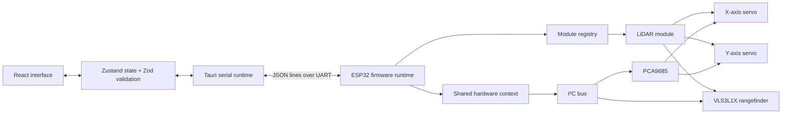

<div align="center">

# Pinora

### A desktop control surface and modular Rust firmware for ESP32 projects

Connect. Discover. Monitor. Control.


[](https://tauri.app/)
[](https://react.dev/)
[](https://www.espressif.com/en/products/socs/esp32)
[](https://www.rust-lang.org/)

> [!WARNING]
> **Pinora v0.1.0 is a pre-alpha prototype.** Its architecture, protocol, APIs,
> wiring, and module behavior may change without notice. It is intended for
> experimentation and active development, not production or safety-critical use.

</div>

---

## What is Pinora?

Pinora is an experimental system for discovering, monitoring, and controlling
hardware modules connected to an ESP32. It consists of two cooperating projects:

- A Tauri desktop application built with React, TypeScript, and Rust
- Modular ESP32 firmware written in Rust

The firmware registers its available modules at runtime and publishes their
events over a serial connection. The desktop application validates those
messages, builds a live interface from the registrations, keeps module state in
sync, and sends typed commands back to the ESP32.

The current firmware combines two servos and a VL53L1X time-of-flight sensor into
a two-axis LiDAR scanner. The desktop application provides device controls,
connection settings, activity logs, and an interactive LiDAR visualization.

## Project status

| | State |
|---|---|
| **Release** | `v0.1.0` |
| **Maturity** | Pre-alpha |
| **Firmware target** | ESP32 / `xtensa-esp32-espidf` |
| **ESP-IDF** | `v5.5.3` |
| **Firmware edition** | Rust 2021 |
| **Desktop stack** | Tauri 2, React 19, TypeScript, Vite |
| **Device interface** | Newline-delimited JSON over UART |
| **Default baud rate** | `115200` |

## System architecture



The system is divided into four main layers:

1. **Firmware modules** own hardware behavior, receive typed commands, and emit
   registrations and events.
2. **Serial protocol** carries one JSON object per line between the firmware and
   desktop application.
3. **Tauri runtime** opens the serial port, reads and batches incoming data, and
   writes commands.
4. **React application** validates protocol data, maintains module state, and
   renders controls and visualizations.

Incoming serial messages are sent to the frontend after 250 messages or
approximately 33 ms, whichever happens first.

The Rust wire contract has one source of truth in the root
[`protocol/`](protocol/) directory. Both the firmware and Tauri backend depend
on the root `pinora-shared` crate; protocol types should not be copied into
either consumer.

## Current capabilities

- Discover serial ports and connect at a configurable baud rate
- Register modules dynamically when the ESP32 announces them
- Track runtime UUIDs, readable lookup IDs, and parent-child relationships
- Validate incoming messages before adding them to application state
- Batch high-frequency sensor messages in the Tauri backend
- Display live module state and send hardware commands
- Control two servos through a PCA9685 PWM controller
- Read distance measurements from a VL53L1X sensor
- Run a two-axis LiDAR scan over a selected region of interest
- Visualize LiDAR distance data on an interactive 181 × 181 canvas
- Inspect a rolling activity log of registrations and module events

### Module support

| Module | Firmware | Active in firmware | Desktop support |
|---|:---:|:---:|:---:|
| LiDAR | ✅ | ✅ | Registration, events, scan controls, ROI, movement, heatmap |
| Rangefinder | ✅ | ✅, as LiDAR child | Registration, events, and controls |
| Servo | ✅ | ✅, as LiDAR children | Registration, events, and angle control |
| LED | ✅ | ❌ | Registration, events, brightness, and toggle controls |
| Button | ✅ | ❌ | Registration and read-only press state |
| LED cluster | Partial | ❌ | Partial command schema |
| IMU | Planned | ❌ | Identifier only |
| System log | ✅ | ✅ | Activity log |

## Folder structure

```text
.
├── protocol/                     # Shared Rust wire-protocol definitions
├── lib.rs                        # pinora-shared crate entry point
├── Cargo.toml                    # Shared protocol crate manifest
├── UI_Templates/                 # Desktop application
│   ├── src/                       # React + TypeScript frontend
│   │   ├── components/            # Module controls and reusable UI
│   │   ├── lib/                   # Protocol schemas and state stores
│   │   ├── page/                  # Application pages
│   │   ├── Layout.tsx             # Application shell
│   │   └── main.tsx               # Frontend entry point
│   ├── src-tauri/                 # Native Tauri backend
│   │   ├── capabilities/          # Tauri permissions
│   │   ├── src/
│   │   │   ├── shared_types/      # Serial runtime state
│   │   │   └── lib.rs             # Commands and serial worker
│   │   ├── Cargo.toml
│   │   └── tauri.conf.json
│   ├── package.json
│   ├── vite.config.ts
│   └── bun.lock
├── Firmware_Templates/            # ESP32 firmware
│   ├── .cargo/config.toml          # ESP target, linker, and runner
│   ├── .github/workflows/          # Firmware CI checks
│   ├── src/
│   │   ├── core/                   # Module and hardware foundations
│   │   ├── module/                 # Hardware module implementations
│   │   ├── protocol/               # Re-export of pinora-shared
│   │   ├── utilities/              # Logging and math helpers
│   │   └── main.rs                 # Firmware setup and main loop
│   ├── Cargo.toml
│   ├── rust-toolchain.toml
│   └── sdkconfig.defaults
└── README.md
```

## Getting started

### Prerequisites

For the desktop application, install:

- [Bun](https://bun.sh/)
- [Rust](https://www.rust-lang.org/tools/install)
- The [Tauri 2 system prerequisites](https://v2.tauri.app/start/prerequisites/)
  for your operating system
- A USB serial driver for the ESP32 board, if required

For the firmware, install the ESP Rust development environment and ensure the
following commands are available:

- `cargo`
- The Espressif `esp` Rust toolchain
- `ldproxy`
- `espflash`

The firmware selects the `esp` toolchain automatically and targets
`xtensa-esp32-espidf`.

### Build and run the firmware

```bash
cd Firmware_Templates
cargo build
cargo run --release
```

The configured Cargo runner uses `espflash flash --monitor`, so
`cargo run --release` builds the firmware, flashes the connected ESP32, and opens
the serial monitor.

To create a size-optimized build without flashing:

```bash
cd Firmware_Templates
cargo build --release
```

### Run the desktop application

```bash
cd UI_Templates
bun install
bun run tauri dev
```

Then:

1. Open **Port Settings**.
2. Select the ESP32 serial port.
3. Confirm the baud rate; the default is `115200`.
4. Connect and wait for module registrations.
5. Use **Devices**, **Dashboard**, and **Logs** to interact with the hardware.

To run only the browser frontend:

```bash
cd UI_Templates
bun run dev
```

Serial features require the Tauri runtime and do not work in a regular browser
tab.

### Build the desktop application

```bash
cd UI_Templates
bun run tauri build
```

Tauri writes platform-specific bundles beneath
`UI_Templates/src-tauri/target/release/bundle/`.

## Hardware

The active firmware configuration expects:

- An ESP32 development board
- A PCA9685 16-channel PWM controller
- Two compatible hobby servos
- A VL53L1X time-of-flight distance sensor
- A shared I²C bus using GPIO 21 for SDA and GPIO 22 for SCL at 400 kHz
- Servo X on PCA9685 channel `C0`
- Servo Y on PCA9685 channel `C1`

> [!WARNING]
> Do not power servos directly from the ESP32's 3.3 V pin. Use a suitable
> external supply, connect the grounds, verify voltage requirements, and test
> with the mechanism unloaded. The current firmware moves both servos during
> initialization.

The current servo defaults are:

| Setting | Value |
|---|---:|
| Physical angle range | 0° to 180° |
| Logical pivot range | -90° to +90° |
| Center offset | 90° |
| Pulse range | 500–2500 µs |

These values are currently defined in
`Firmware_Templates/src/module/lidar.rs` and must be calibrated for the physical
assembly.

## Serial protocol

Pinora uses one newline-terminated JSON object per message:

- Commands travel from the desktop application to the ESP32.
- Registrations, module events, and system logs travel from the ESP32 to the
  desktop application.
- Each module receives a runtime UUID when the firmware starts.

The firmware definitions in `Firmware_Templates/src/protocol/` and desktop
definitions in `UI_Templates/src/lib/` and
`UI_Templates/src-tauri/src/protocol/` must remain aligned.

### Register a module

```json
{
  "type": "Registration",
  "payload": {
    "id": "generated-runtime-uuid",
    "module_type": "Servo",
    "lool_up_id": "servo_x",
    "parent_id": "parent-lidar-uuid"
  }
}
```

> [!NOTE]
> `lool_up_id` is the current wire-format field name. Its spelling is retained
> for compatibility during pre-alpha development.

### Send a module event

```json
{
  "type": "ModuleEvent",
  "payload": {
    "module_type": "Led",
    "event": {
      "event_type": "Brightness",
      "id": "led-runtime-uuid",
      "level": 80
    }
  }
}
```

### Send commands to the firmware

Start a LiDAR scan:

```json
{"id":"lidar-runtime-uuid","module_type":"Lidar","payload":{"command":"StartScan"}}
```

Change the scan step:

```json
{"id":"lidar-runtime-uuid","module_type":"Lidar","payload":{"command":"SetStep","step":5}}
```

Move to a position:

```json
{"id":"lidar-runtime-uuid","module_type":"Lidar","payload":{"command":"MovePos","p":{"x":15,"y":-10}}}
```

Set a region of interest:

```json
{"id":"lidar-runtime-uuid","module_type":"Lidar","payload":{"command":"Roi","min":{"x":45,"y":-30},"max":{"x":-45,"y":30}}}
```

## Current limitations

- The serial protocol is not versioned and may change.
- Firmware pins, PWM channels, servo calibration, and scan defaults are
  hard-coded.
- Module UUIDs change after every restart.
- The firmware currently activates only the composite LiDAR path.
- UART is the only firmware transport.
- The scan loop advances from firmware ticks rather than confirmed servo
  settling.
- Completed point maps are not emitted at the end of a scan.
- Reconnect and device hot-plug behavior are basic.
- Some protocol definitions are duplicated between Rust and TypeScript.
- Some low-level firmware operations still need safer error recovery.
- Automated unit, integration, and hardware-in-the-loop tests are not yet
  included.
- Desktop packaging has not been validated on every supported platform.

## Development checks

Run the desktop checks:

```bash
cd UI_Templates
bun run build
```

Run the firmware checks:

```bash
cd Firmware_Templates
cargo fmt --all -- --check
cargo clippy --all-targets --all-features --workspace -- -D warnings
cargo build --release
```

## Contributing

When contributing:

1. Keep the Rust and TypeScript protocol definitions aligned.
2. Preserve the one-JSON-object-per-line wire format.
3. Validate incoming serial data before adding it to application state.
4. Document changes to pins, addresses, calibration, or message schemas.
5. Test changes against physical hardware when possible.
6. Clearly identify behavior that has not been hardware-tested.

## License

No license has been added yet. Until one is provided, the source remains under
the copyright of its author and should not be assumed to be open-source
licensed.

---

<div align="center">

Built for curious hardware experiments—one module at a time.

**Pinora v0.1.0 · Pre-alpha**

</div>
