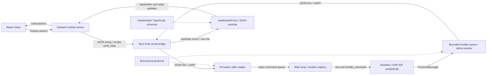

# Pinora

**v0.5.0-alpha**

> [!WARNING]
> **ALPHA SOFTWARE — ARCHITECTURE HIGHLY UNSTABLE**
>
> Pinora is in active alpha development. The current implementation is stable enough for the author's present development workflow, but its architecture and public contracts are not stable.
>
> APIs, protocol structures, module boundaries, frontend and firmware architecture, state management, transports, types, names, and file layout may change frequently. Components may be moved, rewritten, replaced, or removed with little notice. There are no compatibility or migration guarantees between alpha revisions.
>
> Production use is not recommended. External integrations, architecture-dependent forks, and long-lived tooling should not depend on the current internals. Coordinate substantial contributions with the maintainer before starting work.

Pinora connects an ESP32 hardware application to a React/Tauri desktop control workspace through newline-delimited JSON. Firmware owns peripherals and module behavior; the desktop discovers module registrations and displays device events. This repository is primarily the author's active development environment.

## Documentation entry point

This README describes the current working-tree implementation, including ongoing UI development. Source is authoritative. See the [architecture review and version inventory](docs/architecture-audit.md) for concrete limitations, evidence, and the scope of this documentation pass.

- [Architecture overview](#architecture-overview) and [data flow](#data-flow)
- [Frontend](#frontend-architecture), [firmware](#firmware-architecture), and [shared protocol](#shared-protocol)
- [Module coverage](#module-system) and [transports](#transport-layer)
- [Toolchain](#development-toolchain), [building](#building), and [configuration](#configuration)
- [Limitations](#current-limitations) and [external use](#external-use--contributions)

## Development status

| Dimension | Current policy |
|---|---|
| Current implementation | Stable enough for the author's present development workflow; this audit does not establish hardware reliability |
| Architecture | Highly unstable alpha architecture, including internal and public APIs |
| Compatibility | No compatibility guarantees between development revisions; product version is not a negotiated wire version |
| External use | Not a stable platform for production systems or third-party integrations |

## What Pinora is

Pinora is a modular embedded-control development project. It contains real actuator and sensor implementations and a desktop interface for serial discovery, protocol inspection, and controls. It is not yet a general-purpose robotics framework with stable extension APIs.

## v0.5.0-alpha

This milestone label describes the current tree, rather than a historical changelog:

- React dashboard with serial connection controls, a startup ESP32 information snapshot, virtualized protocol logs, LED controls, and servo controls.
- ESP32 firmware starts three PWM LEDs and one PCA9685-backed servo.
- Rust protocol types cover additional sensor/actuator families, with uneven desktop coverage.
- Compiled but inactive LiDAR composition and a frontend-only LiDAR playground are in development.
- First-party product/package versions share `0.5.0-alpha`. Dependency, compiler, SDK, and schema versions retain their own meanings.

## Architecture overview



| Subsystem | Responsibility and state owner | Boundary |
|---|---|---|
| React frontend | Connection presentation, registry, per-module stores, logs, theme and view drafts | Tauri `invoke` commands and `espState` events |
| Tauri backend | Serial port, cloned reader handle, thread lifecycle, writes | Raw strings; does not depend on `pinora-protocol` or own domain/module state |
| Firmware | Hardware state, module UUIDs, top-level registry and scheduling | Typed commands in; typed protocol messages out |
| Rust protocol | Serde wire definitions shared with firmware | No ESP-IDF or UI-framework dependencies |
| TypeScript protocol | Manually maintained Zod schemas and inferred types | Duplicates only part of Rust protocol; not generated or enforced at the receive boundary |

There is no root Cargo workspace. Firmware, protocol, and `UI/src-tauri` are separate Cargo packages; `UI` is the frontend package. Firmware has a local path dependency on protocol. Desktop Rust does not. No first-party CLI implementation, CI workflow, or complete scaffold generator was found in the current tree.

## Architecture stability

These internals are especially transitional:

- Frontend global connection/registry ownership versus per-module stores and component-local drafts.
- Handwritten Rust/TypeScript wire definitions and incomplete schema coverage.
- Registration timing, reconnect cleanup, parent/child module addressing, and initial-state replay.
- Raw serial IPC versus a future transport abstraction; Wi-Fi/Bluetooth output variants remain stubs.
- LiDAR scan logic, UI controls, module hierarchy, and event chunk delivery.
- Template metadata and development recipes left over from earlier architecture.

All may change substantially before a stable release. See the [evidence-based review](docs/architecture-audit.md#architecture-quality-review).

## Repository structure

| Path | Ownership |
|---|---|
| [UI/src](UI/src) | React entry point, pages, components, Zustand stores, handwritten protocol schemas |
| [UI/src-tauri](UI/src-tauri) | Native serial bridge, Tauri metadata, permissions and packaging |
| [Firmware_Templates/src](Firmware_Templates/src) | ESP32 boot wiring, core helpers, hardware modules and utilities |
| [protocol/src](protocol/src) | Rust commands, events, registration, identity and payload types |
| [protocol/tests/event_package.rs](protocol/tests/event_package.rs) | Serialization tests; some expectations are stale |
| [pinora.toml](pinora.toml) | Product/template metadata and directory names; not a runtime hardware loader |
| [justfile](justfile) | Convenience recipes, including stale UI Cargo recipes |
| [.espConfig/esp_config.json](.espConfig/esp_config.json) | Legacy machine-specific paths and commands |
| [Firmware_Templates/pre-script.rhai](Firmware_Templates/pre-script.rhai) | Template-variable script; no complete generator invocation is wired here |
| [docs/architecture-audit.md](docs/architecture-audit.md) | Architecture debt, version inventory and validation notes |

`node_modules`, `dist`, `target`, and `.embuild` are generated dependencies/output, not architecture components. Firmware and Tauri Cargo lockfiles and the Bun lockfile are tracked; the standalone protocol lockfile is ignored.

## Data flow

**Command:** LED slider commit or servo control → per-module action → [IncomingCommand.ts](UI/src/lib/IncomingCommand.ts) serializes `{id, command}` → `invoke("send_data")` → Rust appends a newline and writes serial → firmware stdin deserializes `IncomingCommand` → unbounded `mpsc` queue → exact UUID lookup in the top-level registry → module `handle_command` → hardware write → returned event.

**Event:** module emits `EventPackage { id, event }` → bounded emitter queue → JSON stdout line → desktop serial reader accumulates through newline → Tauri `espState` carries the raw string → frontend trims and parses JSON → logs the message → routes registration/system/module event → per-module store → React subscription. Plain console lines go to console diagnostics; JSON parsing is not schema validation.

**Connection:** frontend disconnects first, installs an event listener, then invokes `start_port`. Backend closes the previous connection, opens the port, changes DTR/RTS (which may reset attached hardware), clones the reader, and starts a thread. Stop clears the running flag, drops the writer and joins the reader. Frontend disconnect clears listeners and system info, but currently retains module registries and logs.

## Frontend architecture

[UI/src/App.tsx](UI/src/App.tsx) uses React Router hash routes for `/` and `/lidar`, with [AppLayout](UI/src/components/AppLayout.tsx) providing a sidebar and theme controls. Vite serves port 1420; `@` resolves to `UI/src`. React 19, TypeScript, Zustand 5, Zod 4, Tailwind 4, and reusable Base UI/shadcn-style components are declared in [package.json](UI/package.json).

[useModuleFront](UI/src/lib/Modulefront.TS) owns connection status, listener cleanup functions, a UUID-to-store registry, a lookup-name-to-UUID map, protocol logs, and the latest system snapshot. Registration creates vanilla Zustand stores for LED, Servo, or LiDAR; other kinds are ignored. Duplicate IDs replace stores and duplicate lookup names overwrite the lookup entry. Parent IDs are not modeled as a UI hierarchy.

[Module implementations](UI/src/lib/Modules) colocate schemas, state/actions, and React views. Firmware events drive reported LED/servo values; sliders may hold local drafts. Dashboard discovers LED and servo stores, but currently gates both on the presence of a connected LED. [LogViewer](UI/src/components/LogViewer.tsx) virtualizes rendering, while the underlying log array remains unbounded. SysLog messages can be displayed there even when module-store dispatch rejects their source.

The LiDAR route inserts `fake-lidar` into the real global registry. Its control actions are no-ops and its event handler only logs; the canvas is a coordinate/pivot playground, not a live scan renderer. Browser-only Vite preview does not provide native serial IPC; console forwarding also calls the Tauri logging plugin.

## Firmware architecture

[main.rs](Firmware_Templates/src/main.rs) initializes ESP-IDF patches/logging, the emitter and UART0 console, sends system information, takes peripherals, constructs shared hardware, creates modules, registers them, and starts the stdin reader. Hardware wiring is authored directly here.

Current startup wiring:

| Instance | Hardware/configuration |
|---|---|
| `led1`, `led2`, `led3` | GPIO 12, 14, 27; LEDC channels 0, 1, 2; shared 5 kHz / 13-bit timer |
| `servo` | PCA9685 channel C0, default I2C address; configured 0–180 degrees with ±90 pivot and 500–2500 microsecond pulse mapping |
| Shared I2C | I2C0, SDA GPIO21, SCL GPIO22, 100 kHz |

[HardwareContext](Firmware_Templates/src/core/hardware.rs) initializes PCA9685 at prescale 100 and enables it unconditionally. Current boot therefore depends on this I2C device even for an LED-focused session. Servo construction writes several test positions before returning to zero pivot; connecting/resetting hardware is not a passive operation.

The main thread owns `HashMap<String, Box<dyn Module>>` and peripheral lifetimes. I2C/PWM sharing uses `Rc<RefCell<...>>` and `RcDevice` on that thread. Each iteration ticks all modules, processes at most one command, and yields 1 ms after roughly 650 ms between yields. This is cooperative polling, not a fixed-rate scheduler. Tick errors are discarded; handler errors propagate out of `main`.

[Emitter](Firmware_Templates/src/core/emitter.rs) has a 128-message `sync_channel` and a stdout serialization worker. Registration/system messages block until enqueue succeeds; runtime events/logs use `try_send` and can be dropped. Reliable enqueue is not acknowledgement, persistence, or guaranteed delivery. System heap/flash/partition fields are formatted strings captured once at startup; `maximum_app_slot` is the running partition size, not a scan of all slots.

Important dependencies include ESP-IDF service/HAL/sys, Serde, UUID, embedded-hal bus sharing, PCA9685, VL53L1X ULD and MFRC522. A dependency alone does not imply active hardware support. See [module coverage](#module-system).

## Shared protocol

[protocol/src](protocol/src) defines the actual Rust wire contract. Default Serde external tags are used for envelope enums; some payload families retain internal `event_type` tags. Do not infer one uniform payload shape.

| Type | Current content |
|---|---|
| `IncomingCommand` | String `id` and nested `command`; no longer flattened |
| `ModuleCommand` | Led, Servo, Lidar, Rangefinder, StepperMotor, Rfid |
| `ProtocolMessage` | Registration, ModuleEvent, System |
| `EventPackage` | Source UUID `id` plus `ModuleEvent` |
| `ModuleEvent` | Led, Servo, Lidar, Button, SysLog, Rangefinder, StepperMotor, Imu, Rfid, RemoteReceiver |
| `Registration` | `id`, `module_type`, `lool_up_id`, `parent_id` |

Current LED examples (each transported as one JSON line):

```json
{"id":"module-uuid","command":{"Led":{"SetState":{"state":80}}}}
```

```json
{"ModuleEvent":{"id":"module-uuid","event":{"Led":{"Brightness":{"level":80}}}}}
```

`lool_up_id`, `manuel_id`, `RangPoint`, `distant`, and `Idol` are existing spellings, not documentation typos to silently normalize. Runtime UUIDs are regenerated at boot; lookup names are caller-provided labels. No wire-version negotiation or compatibility handshake is implemented. Alpha protocol compatibility is not guaranteed. Aligning the protocol crate's package version does not add a schema version or change message layouts.

The desktop duplicates protocol definitions manually in [UI/src/lib/protocol](UI/src/lib/protocol) and module files. Receive handling uses `JSON.parse` and casts rather than Zod `.parse`. Aggregate TS schemas omit Servo despite implemented Servo actions/events, and LiDAR start/stop/test are modeled as strings while Rust uses empty struct variants. This is documented debt, not a stable extension contract.

## Module system

[ModuleCore and Module](Firmware_Templates/src/core/modulecore.rs) provide UUID identity, module kind, manual lookup name, optional parent identity, registration, event/log emission, `tick`, and `handle_command`. The main registry routes only top-level IDs. LiDAR owns two servo children and a rangefinder and registers them, but registration does not insert those children into the main dispatch map. LiDAR-specific commands can address its motors through the parent handler.

| Family | Firmware status | Current desktop coverage |
|---|---|---|
| LED | Implemented and instantiated ×3 | Registration, brightness events, set/toggle controls |
| Servo | Implemented and instantiated ×1; startup test motion | Registration, events and angle control; schema coverage incomplete |
| LiDAR | Compiled experimental composite, not instantiated; scan/chunk logic exists | Fake module/playground; command actions and event-state update unfinished |
| VL53L1X rangefinder | Compiled ranging/configuration implementation, not instantiated | No registration store/view |
| Stepper, button, RFID, IMU, remote receiver | Compiled implementations, not instantiated by current main | No current store/view registration route |
| Joystick | Source file excluded by module declaration | No current integration |
| LED cluster | Classification enum only | No current integration |

These labels describe source integration, not hardware qualification. Extending a module involves Rust payloads, firmware behavior and startup wiring, registration/routing, TS types, store actions and views. There is no automatic plugin discovery or code generation tying these steps together.

## Transport layer

| Transport | Status |
|---|---|
| Serial/UART | Implemented bidirectionally; newline-delimited JSON mixed with console output |
| Tauri IPC | Implemented desktop bridge: port enumeration/start/stop/send plus `espState` receive events |
| Wi-Fi / Bluetooth | Firmware emitter enum branches with no output; no current desktop transport implementation |

The backend keeps transport bytes separate from domain state, but frontend stores directly invoke Tauri. There is no common interchangeable transport interface across both ends, no frame-size cap, and no delivery acknowledgement/retry protocol.

## Development toolchain

- **Supported firmware compiler: ESP Rust 1.93.0.0 (`esp-1.93`), LLVM 20.1.1.** [rust-toolchain.toml](Firmware_Templates/rust-toolchain.toml) selects it.
- **ESP-IDF 5.5.3**, target `xtensa-esp32-espidf`, MCU `esp32`. Cargo builds `std` and `panic_abort` through `build-std`; `ldproxy` is the linker wrapper.
- ESP Rust 1.97.0.0 / LLVM 21.1.3 is not supported for Pinora: the controlled trial failed in Xtensa aggregate ConstantPool lowering, matching [esp-rs/rust #277](https://github.com/esp-rs/rust/issues/277). Keep 1.93; do not apply dependency or optimization workarounds. Re-test a released compiler containing the fix before adoption.
- Desktop: host Rust/Cargo, platform Tauri build prerequisites, Bun, and the versions declared in the frontend manifest (React 19.2.7, TypeScript ~6.0.3, Vite ^8.0.16, Tauri 2). No repository Bun/Node engine pin was found; these are not claimed as minimum versions.
- Protocol uses edition 2024; firmware's `rust-version = "1.82"` is not a sufficient minimum for the whole project.

The firmware manifest's ESP Git patches do not pin `rev`; the tracked lockfile fixes the current commits. Preserve it and use locked/frozen builds. Frozen also requires the relevant registry, Git, SDK, and build-std caches to be available.

Historical local compiler records `C:\b193`, current control `C:\c193`, and failed trial `C:\c197` are preserved external artifacts, not fresh-clone prerequisites. This release-label pass changes local package metadata in lockfiles, so their old whole-file hashes no longer describe the newly labeled tree; third-party resolution is unchanged.

## Building

Run commands from the indicated directories. These are configured entry points, not a claim that every current development target passes validation.

Frontend assets, from `UI`:

```powershell
bun install --frozen-lockfile
bun run build
```

Desktop packaging, from `UI` (runs the configured frontend build first):

```powershell
bun run tauri build
```

Host protocol checks, from `protocol`:

```powershell
cargo test --frozen
```

The standalone protocol lockfile is ignored. A fresh clone may need an initial deliberate dependency fetch/resolution before frozen tests; do not regenerate the firmware lockfile to address that. Some current serialization assertions expect old shapes; see the audit notes.

Firmware, from `Firmware_Templates`, with the existing ESP 1.93 environment loaded:

```powershell
cargo +esp-1.93 build --frozen
cargo +esp-1.93 build --frozen --release
```

The current Windows target directory is `C:/t`. For isolated experiments, select a short unused path with `--target-dir`; long Windows build-script output paths have failed. Do not reuse or clean the preserved control/trial directories.

The justfile's `ui` recipe runs Tauri, but comments still say Slint; `build-ui`, `check-ui`, and the UI part of `clean` run Cargo in `UI`, where no Cargo manifest exists. Consequently `build-all`/`check-all` are not reliable current entry points. Use direct commands above until these recipes are repaired in a separate tooling change.

## Running / development

From `UI`, `bun run tauri dev` launches the native desktop plus Vite. `bun run dev` alone starts frontend development without native transport services. Select the serial port and a matching baud rate in the dashboard; 115200 is the form default. Connection toggles control lines and may reset the board. Registration and system info are sent at boot; there is no working rediscovery request (`SSI` is an empty firmware branch).

**Hardware-required operation:** from `Firmware_Templates`, `cargo +esp-1.93 run --frozen --release` uses the configured `espflash flash --monitor` runner and writes firmware to hardware. Review current wiring and servo startup motion before running it. Stop any other serial monitor before connecting the desktop. No hardware operation was performed for this documentation pass.

## Configuration

| File | Meaning |
|---|---|
| [Firmware Cargo config](Firmware_Templates/.cargo/config.toml) | Target/cache directory, linker/runner, MCU/IDF environment, build-std |
| [Firmware manifest](Firmware_Templates/Cargo.toml) | Dependencies, Git patches, unchanged development/release optimization |
| [sdkconfig.defaults](Firmware_Templates/sdkconfig.defaults) | Main stack 8192; event/idle/pthread stacks 4096 |
| [build.rs](Firmware_Templates/build.rs) | Propagates embuild ESP-IDF environment |
| [Tauri config](UI/src-tauri/tauri.conf.json) | Dev/build hooks, window, assets and bundle metadata; template product name/identifier remain |
| [Tauri capabilities](UI/src-tauri/capabilities/default.json) | Main-window core/opener/log permissions |
| [Vite config](UI/vite.config.ts) / [TS config](UI/tsconfig.json) | React/Tailwind plugins, port, aliases, strict type/unused checks |
| [pinora.toml](pinora.toml) | Release metadata; `schema_version = 1` is separately meaningful |

No runtime consumer of `pinora.toml` or `.espConfig/esp_config.json` was found in authored application/build code. The Rhai script lists additional chip targets; that is template data, not verified board support.

## Current limitations

The [architecture review](docs/architecture-audit.md#architecture-quality-review) details stale reconnect state, incomplete runtime validation, pre-registration events, silent serial/send failures, unbounded buffers, inconsistent error propagation, mixed payload tags, stale tests and partial LiDAR behavior. There is no verified end-to-end hardware test suite or current CI workflow in this tree. The alpha runtime policy must not be interpreted as a test certificate or stable API promise.

## Roadmap / near-term direction

Existing partial code points toward LiDAR controls and scan-state visualization, broader module UI coverage, and transport/template cleanup. These are unfinished areas to coordinate with the maintainer, not release commitments. Protocol/identity/lifecycle decisions can change as that work proceeds.

## External use / contributions

Pinora v0.5.0-alpha is primarily under active personal development. Coordinate major architectural contributions first. External users must expect frequent breaking internal changes and should not build production systems or long-lived integrations against these contracts. This policy describes alpha maturity; it does not imply abandonment or determine licensing.

## License

No repository license file or first-party manifest license declaration was found in the current tree. Do not infer a project license from third-party dependencies, template assets, or historical documentation. Clarify intended licensing with the maintainer before external redistribution.
