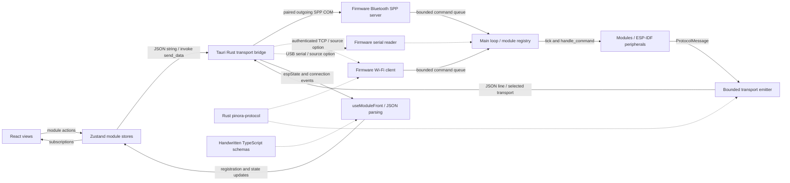

# PINORA v0.8.0-alpha

**Maintainer-developed ESP32 control workspace. Release metadata: `0.8.0-alpha`.**

> [!WARNING]
> **ALPHA SOFTWARE — ARCHITECTURE HIGHLY UNSTABLE**
>
> Pinora is in active alpha development. The current implementation is stable enough for the author's present development workflow, but its architecture and public contracts are not stable.
>
> APIs, protocol structures, module boundaries, frontend and firmware architecture, state management, transports, types, names, and file layout may change frequently. Components may be moved, rewritten, replaced, or removed with little notice. There are no compatibility or migration guarantees between alpha revisions.
>
> Production use is not recommended. External integrations, architecture-dependent forks, and long-lived tooling should not depend on the current internals. Coordinate substantial contributions with the maintainer before starting work.

Pinora connects an ESP32 hardware application to a React/Tauri desktop control workspace through newline-delimited JSON. Firmware owns peripherals and module behavior; the desktop discovers module registrations and displays device events. This repository is primarily the author's active development environment.

## Documentation entry point

This README describes the current working-tree implementation. The maintainer reports that Bluetooth is working after pairing; this is not a Codex-verified round-trip hardware result. Source is authoritative. See the [architecture review](docs/architecture-audit.md), [Bluetooth guide](Firmware_Templates/BLUETOOTH_TRANSPORT.md), and [Wi-Fi guide](Firmware_Templates/WIFI_TRANSPORT.md) for details.

- [Architecture overview](#architecture-overview) and [data flow](#data-flow)
- [Frontend](#frontend-architecture), [firmware](#firmware-architecture), and [shared protocol](#shared-protocol)
- [Module coverage](#module-system) and [transports](#transport-layer)
- [Toolchain](#development-toolchain), [building](#building), and [configuration](#configuration)
- [Limitations](#current-limitations) and [external use](#external-use--contributions)

## Development status

| Dimension | Current policy |
|---|---|
| Current implementation | Stable enough for the author's present development workflow; this audit does not establish hardware reliability |
| Architecture | Highly unstable alpha architecture, including internal and public APIs |
| Compatibility | No compatibility guarantees between development revisions; product version is not a negotiated wire version |
| External use | Not a stable platform for production systems or third-party integrations |

## What Pinora is

Pinora is a modular embedded-control development project. It contains real actuator and sensor implementations and a desktop interface for serial discovery, protocol inspection, and controls. It is not yet a general-purpose robotics framework with stable extension APIs.

## v0.8.0-alpha

This milestone label describes the current tree, rather than a historical changelog:

- React dashboard with Serial, Wi-Fi, and paired Bluetooth SPP connection controls, a startup ESP32 information snapshot, virtualized protocol logs, LED controls, and a Button event view.
- The current firmware selects Bluetooth SPP at startup and starts three PWM LEDs. Servo startup wiring is commented out. Windows pairing and outgoing virtual COM discovery have been observed; the maintainer reports the Bluetooth implementation works.
- Rust protocol types cover additional sensor/actuator families, with uneven desktop coverage.
- Compiled but inactive LiDAR composition and an unmounted frontend LiDAR page remain experimental.
- First-party product/package versions share `0.8.0-alpha`. Dependency, compiler, SDK, and schema versions retain their own meanings.

## Architecture overview


```mermaid
flowchart LR
    Views["React views"] -->|"module actions"| Stores["Zustand module stores"]
    Stores -->|"JSON string / invoke send_data"| Backend["Tauri Rust transport bridge"]
    Backend -->|"paired outgoing SPP COM"| Bluetooth["Firmware Bluetooth SPP server"]
    Backend -.->|"authenticated TCP / source option"| Reader["Firmware Wi-Fi client"]
    Backend -.->|"USB serial / source option"| Serial["Firmware serial reader"]
    Bluetooth -->|"bounded command queue"| Registry["Main loop / module registry"]
    Reader -->|"bounded command queue"| Registry
    Serial -.-> Registry
    Registry -->|"tick and handle_command"| Hardware["Modules / ESP-IDF peripherals"]
    Hardware -->|"ProtocolMessage"| Emit["Bounded transport emitter"]
    Emit -->|"JSON line / selected transport"| Backend
    Backend -->|"espState and connection events"| Front["useModuleFront / JSON parsing"]
    Front -->|"registration and state updates"| Stores
    Stores -->|"subscriptions"| Views
    Protocol["Rust pinora-protocol"] -.-> Reader
    Protocol -.-> Emit
    TS["Handwritten TypeScript schemas"] -.-> Front
```

| Subsystem | Responsibility and state owner | Boundary |
|---|---|---|
| React frontend | Connection presentation, registry, per-module stores, logs, theme and view drafts | Tauri `invoke` commands and `espState` events |
| Tauri backend | USB/SPP COM port lifecycle, TCP listener, writes, Wi-Fi authentication and wire validation | COM readers forward raw strings; Wi-Fi deserializes Rust protocol; depends on `pinora-protocol` but does not own module state |
| Firmware | Hardware state, module UUIDs, top-level registry and scheduling | Typed commands in; typed protocol messages out |
| Rust protocol | Serde wire definitions shared with firmware | No ESP-IDF or UI-framework dependencies |
| TypeScript protocol | Manually maintained Zod schemas and inferred types | Duplicates only part of Rust protocol; not generated or enforced at the receive boundary |

There is no root Cargo workspace. Firmware, protocol, and `UI/src-tauri` are separate Cargo packages; `UI` is the frontend package. Firmware and desktop Rust both have local path dependencies on protocol. No first-party CLI implementation, CI workflow, or complete scaffold generator was found in the current tree.

## Architecture stability

These internals are especially transitional:

- Frontend global connection/registry ownership versus per-module stores and component-local drafts.
- Handwritten Rust/TypeScript wire definitions and incomplete schema coverage.
- Registration timing, reconnect cleanup, parent/child module addressing, and initial-state replay.
- Transport queue limits, reconnect replay, development-only Wi-Fi authentication, and Bluetooth pairing behavior.
- LiDAR scan logic, UI controls, module hierarchy, and event chunk delivery.
- Template metadata and development recipes left over from earlier architecture.

All may change substantially before a stable release. See the [evidence-based review](docs/architecture-audit.md#architecture-quality-review).

## Repository structure

| Path | Ownership |
|---|---|
| [UI/src](UI/src) | React entry point, pages, components, Zustand stores, handwritten protocol schemas |
| [UI/src-tauri](UI/src-tauri) | Native serial bridge, Tauri metadata, permissions and packaging |
| [Firmware_Templates/src](Firmware_Templates/src) | ESP32 boot wiring, core helpers, hardware modules and utilities |
| [protocol/src](protocol/src) | Rust commands, events, registration, identity and payload types |
| [pinora.toml](pinora.toml) | Product/template metadata and directory names; not a runtime hardware loader |
| [justfile](justfile) | Convenience development, build, check, flash and clean recipes |
| [.espConfig/esp_config.json](.espConfig/esp_config.json) | Legacy template metadata with relative paths and stale commands; not a current setup guide |
| [Firmware_Templates/pre-script.rhai](Firmware_Templates/pre-script.rhai) | Template-variable script; no complete generator invocation is wired here |
| [docs/architecture-audit.md](docs/architecture-audit.md) | Architecture debt, version inventory and validation notes |

`node_modules`, `dist`, `target`, and `.embuild` are generated dependencies/output, not architecture components. Firmware and Tauri Cargo lockfiles and the Bun lockfile are tracked; the standalone protocol lockfile is ignored.

## Data flow

**Command:** LED slider commit/toggle → per-module action → [IncomingCommand.ts](UI/src/lib/IncomingCommand.ts) serializes `{id, command}` → `invoke("send_data")` → Tauri writes the selected USB/SPP COM port or authenticated TCP frame → selected firmware transport deserializes `IncomingCommand` → existing main-loop receiver → exact UUID lookup in the top-level registry → module `handle_command` → hardware write → returned event.

**Event:** module emits `EventPackage { id, event }` → bounded transport emitter → selected firmware transport writes a JSON line → Tauri Wi-Fi listener validates the Rust `ProtocolMessage` or COM reader forwards a raw line as `espState` → frontend parses JSON → logs and routes registration/system/module event → per-module store → React subscription. Frontend JSON parsing is not Zod validation.

**Connection:** frontend disconnects first and installs listeners. USB Serial opens a COM port and toggles DTR/RTS; Bluetooth opens a paired SPP virtual COM port without USB reset signaling. Wi-Fi starts an authenticated TCP listener. Bluetooth and Wi-Fi firmware workers cache system information and registrations for replay on reconnect; runtime module events are not replayed. Frontend disconnect clears the module registry and system info. A new connection also clears logs; disconnect retains logs.

## Frontend architecture

[UI/src/App.tsx](UI/src/App.tsx) uses React Router hash routes for `/` and `/lidar`, with [AppLayout](UI/src/components/AppLayout.tsx) providing a sidebar and theme controls. Vite serves port 1420; `@` resolves to `UI/src`. React 19, TypeScript, Zustand 5, Zod 4, Tailwind 4, and reusable Base UI/shadcn-style components are declared in [package.json](UI/package.json).

[useModuleFront](UI/src/lib/Modulefront.TS) owns connection status and mode, listener cleanup functions, a UUID-to-store registry, a lookup-name-to-UUID map, protocol logs, and the latest system snapshot. Registration creates vanilla Zustand stores for LED and Button; other kinds are ignored. Duplicate IDs replace stores and duplicate lookup names overwrite the lookup entry. Parent IDs become a `hasParent` flag, not a routable UI hierarchy.

[Module implementations](UI/src/lib/Modules) colocate schemas, state/actions, and React views. Firmware events drive reported LED values; sliders may hold local drafts. Button stores count `Ckick` events. Dashboard discovers LED and Button stores while connected. [LogViewer](UI/src/components/LogViewer.tsx) virtualizes rendering, while the underlying log array remains unbounded. SysLog messages can be displayed there even when module-store dispatch rejects their source.

The LiDAR route inserts `fake-lidar` into the real global registry. Its control actions are no-ops and its event handler only logs; the canvas is a coordinate/pivot playground, not a live scan renderer. Browser-only Vite preview does not provide native serial IPC; console forwarding also calls the Tauri logging plugin.

## Firmware architecture

[main.rs](Firmware_Templates/src/main.rs) initializes ESP-IDF patches/logging and UART0, selects `TransportType::Bluetooth` for the current image, creates the SPP server and emitter, sends system information, constructs shared hardware, creates modules, registers them and starts transport command ingress. Changing the source selection to Wi-Fi or Serial builds those existing paths; no runtime switching or automatic failover exists. Hardware wiring is authored directly here.

Current startup wiring:

| Instance | Hardware/configuration |
|---|---|
| `led1`, `led2`, `led3` | GPIO 12, 14, 27; LEDC channels 0, 1, 2; shared 5 kHz / 13-bit timer |
| `servo` | Constructor and insertion are commented out; no active servo registration or command route |
| Shared I2C | I2C0, SDA GPIO21, SCL GPIO22, 100 kHz |

[HardwareContext](Firmware_Templates/src/core/hardware.rs) currently creates the LED timer and retains the I2C bus. The PCA9685 initialization call is commented out, as is servo startup. Servo construction still contains test motion if that path is re-enabled.

The main thread owns `HashMap<String, Box<dyn Module>>` and peripheral lifetimes. I2C/PWM sharing uses `Rc<RefCell<...>>` and `RcDevice` on that thread. Each iteration ticks all modules, processes at most one command, and yields 1 ms after roughly 650 ms between yields. This is cooperative polling, not a fixed-rate scheduler. Tick errors are discarded; handler errors propagate out of `main`.

[TransportEmiter](Firmware_Templates/src/core/transport/transport_emiter.rs) has a 128-message `sync_channel` and a transport sender worker. Registration/system messages block until enqueue succeeds; runtime events/logs use `try_send` and can be dropped. Wi-Fi and Bluetooth each add bounded work queues and cache system/registration messages for reconnect replay. Reliable enqueue is not acknowledgement, persistence, or guaranteed delivery. System heap/flash/partition fields are formatted strings captured once at startup; `maximum_app_slot` is the running partition size, not a scan of all slots.

Important dependencies include ESP-IDF service/HAL/sys, Serde, UUID, embedded-hal bus sharing, PCA9685, VL53L1X ULD and MFRC522. A dependency alone does not imply active hardware support. See [module coverage](#module-system).

## Shared protocol

[protocol/src](protocol/src) defines the actual Rust wire contract. Default Serde external tags are used for envelope enums; some payload families retain internal `event_type` tags. Do not infer one uniform payload shape.

| Type | Current content |
|---|---|
| `IncomingCommand` | String `id` and nested `command`; no longer flattened |
| `ModuleCommand` | Led, Servo, Lidar, Rangefinder, StepperMotor, Rfid |
| `ProtocolMessage` | Registration, ModuleEvent, System |
| `EventPackage` | Source UUID `id` plus `ModuleEvent` |
| `ModuleEvent` | Led, Servo, Lidar, Button, SysLog, Rangefinder, StepperMotor, Imu, Rfid, RemoteReceiver |
| `Registration` | `id`, `module_type`, `lool_up_id`, `parent_id` |

Current LED examples (each transported as one JSON line):

```json
{"id":"module-uuid","command":{"Led":{"SetState":{"state":80}}}}
```

```json
{"ModuleEvent":{"id":"module-uuid","event":{"Led":{"Brightness":{"level":80}}}}}
```

`lool_up_id`, `manuel_id`, `RangPoint`, `distant`, and `Idol` are existing spellings, not documentation typos to silently normalize. Runtime UUIDs are regenerated at boot; lookup names are caller-provided labels. No wire-version negotiation or compatibility handshake is implemented. Alpha protocol compatibility is not guaranteed. Aligning the protocol crate's package version does not add a schema version or change message layouts.

The desktop duplicates protocol definitions manually in [UI/src/lib/protocol](UI/src/lib/protocol) and module files. Receive handling uses `JSON.parse` and casts rather than Zod `.parse`. Aggregate TS schemas cover active LED/Button plus SysLog, but omit other Rust families. Older Servo/LiDAR module files remain outside current registration routing; LiDAR start/stop/test are modeled as strings while Rust uses empty struct variants. Tauri's Wi-Fi path validates inbound messages with Rust protocol types, while serial remains raw. This is documented debt, not a stable extension contract.

## Module system

[ModuleCore and Module](Firmware_Templates/src/core/modulecore.rs) provide UUID identity, module kind, manual lookup name, optional parent identity, registration, event/log emission, `tick`, and `handle_command`. The main registry routes only top-level IDs. LiDAR owns two servo children and a rangefinder and registers them, but registration does not insert those children into the main dispatch map. LiDAR-specific commands can address its motors through the parent handler.

| Family | Firmware status | Current desktop coverage |
|---|---|---|
| LED | Implemented and instantiated ×3 | Registration, brightness events, set/toggle controls |
| Servo | Compiled implementation; current main startup is commented out | Older store/view code exists but is not registered or shown by the dashboard |
| LiDAR | Compiled experimental composite, not instantiated; scan/chunk logic exists | Fake module/playground; command actions and event-state update unfinished |
| VL53L1X rangefinder | Compiled ranging/configuration implementation, not instantiated | No registration store/view |
| Button | Compiled implementation, not instantiated by current main | Registration, `Ckick` event count and view are wired if a device registers one |
| Stepper, RFID, IMU, remote receiver | Compiled implementations, not instantiated by current main | No current store/view registration route |
| Joystick | Compiled source, not instantiated by current main | No current integration |
| LED cluster | Classification enum only | No current integration |

These labels describe source integration, not hardware qualification. Extending a module involves Rust payloads, firmware behavior and startup wiring, registration/routing, TS types, store actions and views. There is no automatic plugin discovery or code generation tying these steps together.

## Transport layer

| Transport | Status |
|---|---|
| Bluetooth Classic SPP | Current firmware boot selection. Bluedroid server advertises `Pinora Dev ESP32`; authenticated/encrypted SPP carries the existing JSON lines. Tauri opens a paired Windows outgoing virtual COM port. Pairing and port discovery were observed; end-to-end operation is maintainer-reported. |
| Wi-Fi/TCP | Source-selectable firmware path. ESP32 client connects to Tauri listener, authenticates with a shared development token, exchanges newline-delimited JSON, reconnects and replays system/registration messages. No encryption or production credential handling. |
| Serial/UART | Source-selectable firmware path; newline-delimited JSON can mix with console output. |
| Tauri IPC | USB/SPP COM port and Wi-Fi listener commands, `send_data`, `espState`, `wifiConnection`, and `bluetoothConnection` events. |

Tauri's Wi-Fi path validates Rust protocol messages and commands; USB/SPP COM readers forward raw lines. Frontend stores directly invoke Tauri. Bluetooth firmware bounds commands to 8 KiB and chunks writes while waiting for SPP write completion and congestion clearance. The desktop COM reader has no line cap. There is no delivery acknowledgement/retry protocol.

On Windows, `serialport` can classify outgoing Bluetooth COM ports as `Unknown`. Tauri intersects available serial ports with Windows Bluetooth device metadata and excludes the incoming listener. Port numbers are assigned by Windows and must be discovered on each machine; USB programming and outgoing SPP ports are different devices.

## Development toolchain

- **Supported firmware compiler: ESP Rust 1.93.0.0 (`esp-1.93`), LLVM 20.1.1.** [rust-toolchain.toml](Firmware_Templates/rust-toolchain.toml) selects it.
- **ESP-IDF 5.5.3**, target `xtensa-esp32-espidf`, MCU `esp32`. Cargo builds `std` and `panic_abort` through `build-std`; `ldproxy` is the linker wrapper.
- ESP Rust 1.97.0.0 / LLVM 21.1.3 failed a prior controlled trial in Xtensa aggregate ConstantPool lowering, matching [esp-rs/rust #277](https://github.com/esp-rs/rust/issues/277). A fresh frozen 2026-10-08 trial found ESP Rust 1.98.1.0 build-compatible in debug and release with the same current firmware inputs; it is not the project default and has not been hardware-tested. ESP 1.93 remains selected until a separately authorized adoption decision.
- Desktop: host Rust/Cargo, platform Tauri build prerequisites, Bun, and the versions declared in the frontend manifest (React 19.2.7, TypeScript ~6.0.3, Vite ^8.0.16, Tauri 2). No repository Bun/Node engine pin was found; these are not claimed as minimum versions.
- Protocol uses edition 2024; firmware's `rust-version = "1.82"` is not a sufficient minimum for the whole project.

The firmware manifest's ESP Git patches do not pin `rev`; the tracked lockfile fixes the current commits. Preserve it and use locked/frozen builds. Frozen also requires the relevant registry, Git, SDK, and build-std caches to be available.

Historical compiler controls and trial artifacts are preserved outside the repository; they are not fresh-clone prerequisites. The tracked firmware lockfile is authoritative for the working tree.

## Building

Run commands from the indicated directories. These are configured entry points, not a claim that every current development target passes validation.

Frontend assets, from `UI`:

```powershell
bun install --frozen-lockfile
bun run build
```

Desktop packaging, from `UI` (runs the configured frontend build first):

```powershell
bun run tauri build
```

Host protocol build check, from `protocol`:

```powershell
cargo +stable check
```

The standalone protocol lockfile is ignored, so a fresh checkout resolves it locally on the first check. Do not regenerate the firmware lockfile to address that. This repository no longer carries first-party automated test scripts.

Firmware, from `Firmware_Templates`, with the existing ESP 1.93 environment loaded:

```powershell
cargo +esp-1.93 build --frozen
cargo +esp-1.93 build --frozen --release
```

The current Windows target directory is `C:/t`. For isolated experiments, select a short unused path with `--target-dir`; long Windows build-script output paths have failed. Do not reuse or clean the preserved control/trial directories.

The [justfile](justfile) offers matching `build-*` and `check-*` recipes. Its `flash` recipe writes hardware; inspect the selected image and port before using it.

## Running / development

From `UI`, `bun run tauri dev` launches the native desktop plus Vite. `bun run dev` alone starts frontend development without native transport services. See the [Bluetooth guide](Firmware_Templates/BLUETOOTH_TRANSPORT.md) for pairing and outgoing virtual COM identification. Before any Rust build, copy [wifi_config.example.rs](protocol/src/wifi_config.example.rs) to ignored `protocol/src/wifi_config.rs` because the shared protocol declares that module unconditionally. Set local values for Wi-Fi use, select Wi-Fi in firmware source, and rebuild both sides. Serial connection toggles control lines and may reset the board. There is no working rediscovery request (`SSI` is an empty firmware branch).

**Hardware-required operation:** from `Firmware_Templates`, `cargo +esp-1.93 run --frozen --release` uses the configured `espflash flash --monitor` runner and writes firmware to hardware. Review current wiring and network settings before running it. Stop any other serial monitor before connecting the desktop. Compiler builds do not flash hardware.

## Configuration

| File | Meaning |
|---|---|
| [Firmware Cargo config](Firmware_Templates/.cargo/config.toml) | Target/cache directory, linker/runner, MCU/IDF environment, build-std |
| [Firmware manifest](Firmware_Templates/Cargo.toml) | Dependencies, Git patches, unchanged development/release optimization |
| [sdkconfig.defaults](Firmware_Templates/sdkconfig.defaults) | Main stack 8192; event/idle/pthread stacks 4096; Classic SPP/Bluedroid enabled |
| [build.rs](Firmware_Templates/build.rs) | Propagates embuild ESP-IDF environment |
| [Tauri config](UI/src-tauri/tauri.conf.json) | Dev/build hooks, window, assets and bundle metadata; template product name/identifier remain |
| [Tauri capabilities](UI/src-tauri/capabilities/default.json) | Main-window core/opener/log permissions |
| [Vite config](UI/vite.config.ts) / [TS config](UI/tsconfig.json) | React/Tailwind plugins, port, aliases, strict type/unused checks |
| [pinora.toml](pinora.toml) | Release metadata; `schema_version = 1` is separately meaningful |
| [wifi_config.example.rs](protocol/src/wifi_config.example.rs) | Tracked placeholder for ignored local `wifi_config.rs`; local password and token compile into firmware and desktop |
| [bluetooth_config.rs](protocol/src/bluetooth_config.rs) | Shared SPP name and message-size settings, with no static pairing secret |

No runtime consumer of `pinora.toml` or `.espConfig/esp_config.json` was found in authored application/build code. The Rhai script lists additional chip targets; that is template data, not verified board support.

## Current limitations

The [architecture review](docs/architecture-audit.md#architecture-quality-review) details partial reconnect replay, incomplete frontend runtime validation, startup event timing, serial error reporting, bounded transport queues and unbounded frontend logs, inconsistent error propagation, mixed payload tags, and partial LiDAR behavior. There is no first-party automated test suite or current CI workflow in this tree. The maintainer's Bluetooth report does not certify all commands, modules, or reconnection paths.

## Roadmap / near-term direction

Existing partial code points toward LiDAR controls and scan-state visualization, broader module UI coverage, and transport/template cleanup. These are unfinished areas to coordinate with the maintainer, not release commitments. Protocol/identity/lifecycle decisions can change as that work proceeds.

## External use / contributions

Pinora v0.8.0-alpha is primarily under active personal development. Coordinate major architectural contributions first. External users must expect frequent breaking internal changes and should not build production systems or long-lived integrations against these contracts. This policy describes alpha maturity; it does not imply abandonment or determine licensing.

## License

No repository license file or first-party manifest license declaration was found in the current tree. Do not infer a project license from third-party dependencies, template assets, or historical documentation. Clarify intended licensing with the maintainer before external redistribution.
