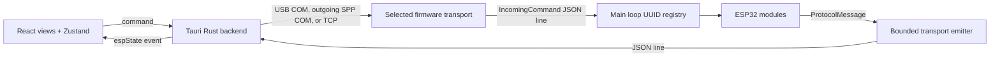

# Pinora architecture audit — v0.8.0-alpha

The [master README](../README.md) is the developer entry point. Pinora is an unstable alpha for the maintainer's development workflow. This document describes implemented code and known limits, not a hardware certification. The maintainer reports that the Bluetooth implementation works; Codex observed Windows pairing and outgoing COM discovery but did not complete an end-to-end LED command check.

## Ownership and data flow

There is no root Cargo workspace. [Firmware](../Firmware_Templates/src/main.rs), [Rust protocol](../protocol/src/lib.rs), and [Tauri backend](../UI/src-tauri/src/lib.rs) are separate Cargo packages; [React](../UI/src/App.tsx) is a Bun frontend. Firmware and Tauri depend on the same Rust protocol crate. The frontend maintains handwritten TypeScript schemas and Zustand stores.

The desktop chooses a connection mode in its Transport card. Firmware chooses exactly one transport in [main.rs](../Firmware_Templates/src/main.rs) at build time; the current source selects Bluetooth. Desktop selection does not switch firmware mode. All three transports carry the same `IncomingCommand` and `ProtocolMessage` JSON shapes, delimited by newline. No Bluetooth-specific command/event schema exists.

## Command and event paths

An LED action serializes `{id,command}`. Tauri's `send_data` writes an open USB/SPP COM port first, or an authenticated Wi-Fi stream. Wi-Fi validates the Rust `IncomingCommand` before sending. The firmware transport parses commands and sends them to the main loop, which looks up a top-level module by UUID and invokes `handle_command`. The `SSI` rediscovery branch is empty; child registration does not provide generic child-ID command routing.

Firmware emits a system snapshot, registrations, and runtime events through [TransportEmiter](../Firmware_Templates/src/core/transport/transport_emiter.rs). Its 128-message queue blocks for system/registration messages and may drop runtime events under pressure. Wi-Fi and Bluetooth cache the latest system message and registrations for reconnect replay; neither replays runtime module events or refreshes the startup snapshot. Tauri validates Wi-Fi protocol lines, while USB/SPP readers forward complete raw lines as `espState`. [useModuleFront](../UI/src/lib/Modulefront.TS) parses JSON, updates logs and the system snapshot, and creates LED or Button stores from registrations. It does not validate every incoming field with Zod.

Module UUIDs are generated during construction. Lookup names are caller supplied; duplicate lookup names overwrite the frontend map. Top-level `parent_id` is serialized as an empty string, and the frontend reduces parent identity to a `hasParent` flag.

## Transport lifecycle

- **USB Serial:** Firmware source can select UART line input/output. Tauri uses `serialport` and toggles DTR/RTS when opening USB Serial, which may reset the board.
- **Wi-Fi:** Firmware is a TCP client. It joins the configured network, connects to the Tauri listener, sends a static development-token handshake, then exchanges protocol JSON lines. The listener binds `0.0.0.0`. Both sides handle disconnects; the firmware retries and replays discovery. The token and Wi-Fi credentials compile from an ignored local config copied from the [example](../protocol/src/wifi_config.example.rs). This is development-only authentication without transport encryption.
- **Bluetooth Classic SPP:** The classic ESP32 starts an encrypted SPP server and becomes discoverable after service startup. Windows pairing uses Secure Simple Pairing with no input/display capability. SPP callbacks copy data to a bounded worker queue; the worker buffers partial JSON lines, sends commands to the shared receiver, chunks outbound writes, and waits for completion and congestion clearance. Overflow disconnects to resynchronize. Tauri opens the paired *outgoing* Windows virtual COM port without USB DTR/RTS sequencing. See the [Bluetooth guide](../Firmware_Templates/BLUETOOTH_TRANSPORT.md).

On this Windows development machine, `serialport` reported paired SPP ports as `Unknown`. [Tauri enumeration](../UI/src-tauri/src/lib.rs) intersects `serialport::available_ports()` with Windows Bluetooth PnP metadata, excluding the incoming listener and unrelated unknown COM ports. COM numbers are assigned by Windows and are not stable configuration.

## Active and inactive modules

Current firmware startup registers three PWM LED modules, named `led1`, `led2`, and `led3`. The dashboard displays LED and Button registrations, although the current startup does not instantiate a Button. LiDAR, servos, steppers, RFID, IMU, rangefinder, joystick, and remote receiver source exists with differing completeness; current firmware startup does not instantiate them. The LiDAR page is not mounted in the active router. Presence of source or a protocol type is not evidence of completed hardware support.

## Architecture quality review

| Area | Current limit |
|---|---|
| Protocol alignment | TypeScript schemas are handwritten and cover fewer variants than the Rust crate; no generation or receive-boundary schema enforcement exists. |
| Identity | Commands route through a top-level UUID map; duplicate lookup names can replace frontend lookup entries. |
| Replay | Wi-Fi/SPP replay system and registration messages, not runtime values. Early startup messages depend on transport caching. |
| Queues | Firmware queues are bounded; runtime events can drop. The desktop COM line buffer and frontend log history are unbounded. |
| Failure paths | Some module tick errors are discarded and command-handler errors can exit the firmware main loop. Error handling varies by transport. |
| Security | Wi-Fi uses a plaintext static development token and a listener on all interfaces. Bluetooth Just Works pairing lacks numeric-comparison MITM protection. |
| Scope | No automatic failover or simultaneous firmware transport routing. Experimental module families remain inactive. |
| Packaging | Tauri product identity and metadata retain template-level values; a first-party license is not declared. |

## Build and validation evidence

ESP Rust `esp-1.93` and ESP-IDF 5.5.3 remain selected for firmware. Earlier frozen compiler trials built the same firmware snapshot with ESP 1.93 and 1.98.1 in debug and release; compiler success alone did not establish runtime compatibility. ESP 1.98.1 is not adopted. ESP 1.99 failed during `build-std` in that trial. The current v0.8.0-alpha working tree passed frozen ESP 1.93 debug/release builds, a host protocol check, a Tauri Rust library build, and a TypeScript/Vite frontend build after cleanup. Those builds did not flash or exercise hardware.

Windows pairing authenticated, and the outgoing Pinora SPP virtual COM port was identified. The maintainer reports Bluetooth operation. Codex has not independently verified every LED command, event, reconnect path, or sustained hardware behavior. No first-party automated test suite or CI workflow is shipped in this tree.

## Configuration and release boundaries

The [firmware guide](../Firmware_Templates/WIFI_TRANSPORT.md) and [Bluetooth guide](../Firmware_Templates/BLUETOOTH_TRANSPORT.md) describe setup. Real `protocol/src/wifi_config.rs` is ignored and must stay out of Git; the tracked example contains placeholders. Generated firmware images, build caches, local compiler trials, and full-flash backups are not release source. Package version `0.8.0-alpha` is release metadata, not a negotiated protocol version.
